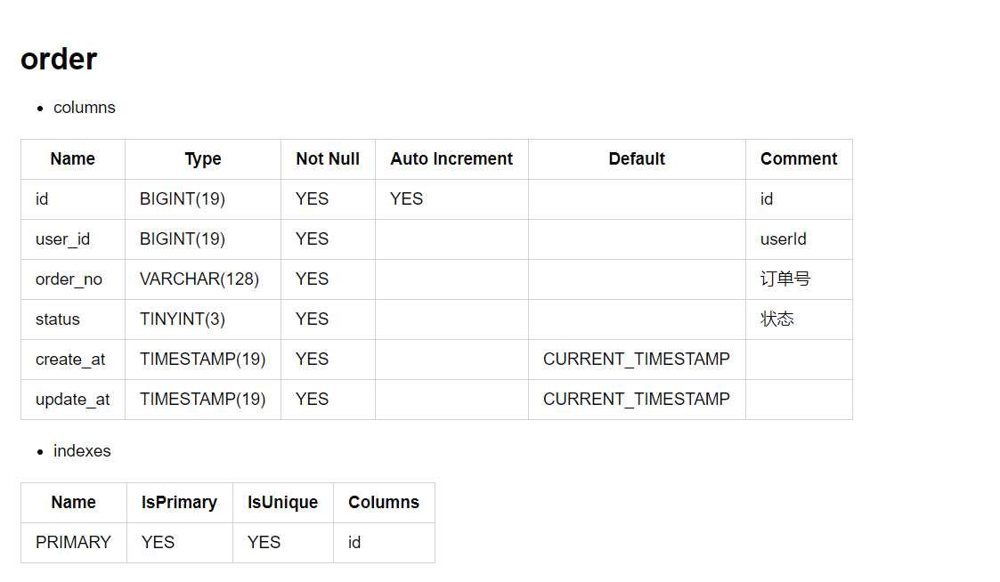

# Databasir

Database document generator

you could use `databasir` to generate database meta model, or render it as markdown / pdf (TODO) / html (TODO)

# How to use

## Database Meta to Java Model

```java
java.sql.Connection connection=...;
        DatabaseMeta meta=Databasir.of().get(connection,"user").orElseThrow();
```

## Render as Markdown

```java
try(FileOutputStream out=new FileOutputStream("user.md")){
        java.sql.Connection connection=...;
        Databasir databasir=Databasir.of();
        DatabaseMeta meta=databasir.get(connection,"user").orElseThrow();
        databasir.renderAsMarkdown(doc,out);
        }catch(IOException e){
        throw new IllegalStateException(e);
        }
```

- Markdown Example




## Ignore tables or columns

support regex pattern to ignore table or column

```java
java.sql.Connection connection=...;
        DatabasirConfig config=new DatabasirConfig();
        config.ignoreColumn("id*");
        config.ignoreTable("flyway.*");
        DatabaseMeta meta=Databasir.of(config).get(connection,"user").orElseThrow();
```

## Extension

Custom configuration

```java
java.sql.Connection connection=...;
        DatabasirConfig config=new DatabasirConfig();
        config.setDatabaseMetaRepository(...); // your custom repository
        config.setTableMetaRepository(...); // your custom repository
        config.setColumnMetaRepository(...); // your custom repository
        config.setTriggerMetaRepository(...); // your custom repository
        config.setIndexMetaRepository(...); // your custom repository
        DatabaseMeta meta=Databasir.of().get(connection,"user").orElseThrow();
```

Default Repository Is

- com.databasir.core.meta.repository.impl.jdbc.JdbcDatabaseMetaRepository
- com.databasir.core.meta.repository.impl.jdbc.JdbcTableMetaRepository
- com.databasir.core.meta.repository.impl.jdbc.JdbcColumnMetaRepository
- com.databasir.core.meta.repository.impl.jdbc.JdbcIndexMetaRepository
- com.databasir.core.meta.repository.impl.jdbc.JdbcTriggerMetaRepository