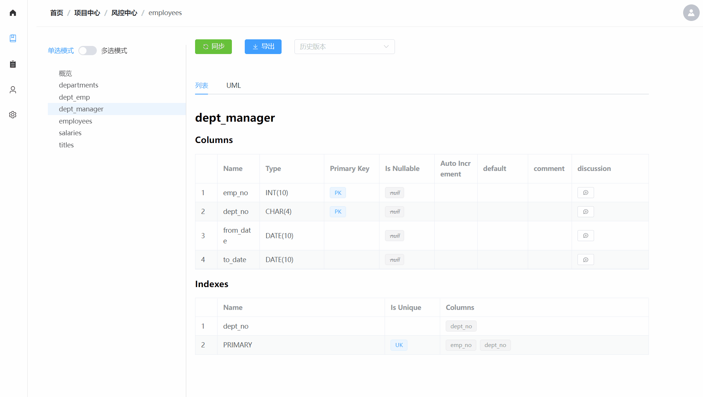

# Databasir

## 文档索引

- [项目简介](#)
- [部署指引](README/deploy.md)
- [构建指引](README/build.md)

更多指引
- [Databasir 之 Github 一键登录（OAuth2）配置](README/github-oauth2/github-oauth2.md)
- [Databasir 之 Gitlab 一键登录（OAuth2）配置](README/gitlab-oauth2/gitlab-oauth2.md)
- [Databasir 保姆级教程之 Docker 一键部署](README/docker-deploy/docker-deploy.md)

## 简介

**Databasir** 是一款集中式的数据库文档管理工具，提供了自动化、版本化、扁平化的数据库文档管理能力，主要功能如下

1. 理论上支持所有拥有 JDBC 驱动的数据库，目前 mysql、postgresql 可以开箱即用
2. 支持 github / github-enterprise / gitlab 的 OAuth2 登录，全图形化配置
3. 支持手动、定时同步数据库结构并自动生成可读性优秀的文档、UML 图
4. 支持多文件格式导出，如 markdown
5. 历史模型版本化，一键查看历史版本
6. 多人协作字段讨论，口口相传不如立个字据
7. 扁平化的团队管理模式，灵活适应不同团队组织架构

## 支持数据库

1. - [x] Mysql
2. - [x] Postgresql
3. - [ ] Oracle
4. - [ ] SqlServer

## 功能规划

- [x] 用户操作审计日志
- [x] 文档自动同步日志
- [ ] Excel 文档导出
- [x] Markdown 文档导出
- [x] Github OAuth2 登录模式
- [x] Gitlab OAuth2 登录模式
- [x] 模型 UML 生成
- [ ] UML 图片导出

## 展示

- 文档页面

- 分组创建

- 项目创建

- 项目同步

- 协作讨论

- 分组成员

- 用户创建

- 用户详情

- 操作日志

