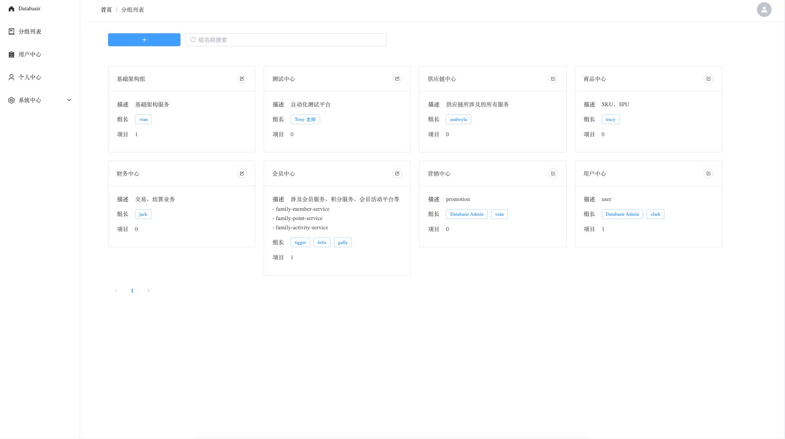
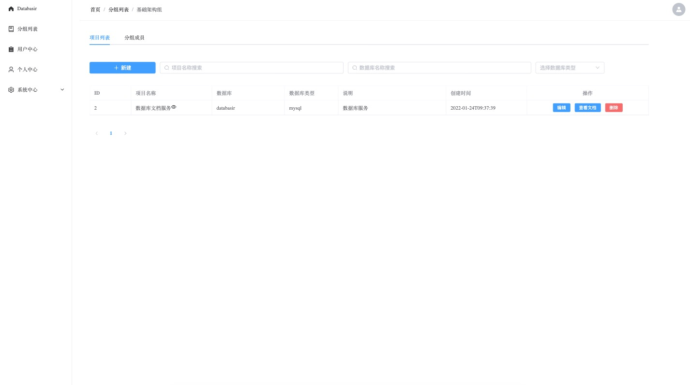
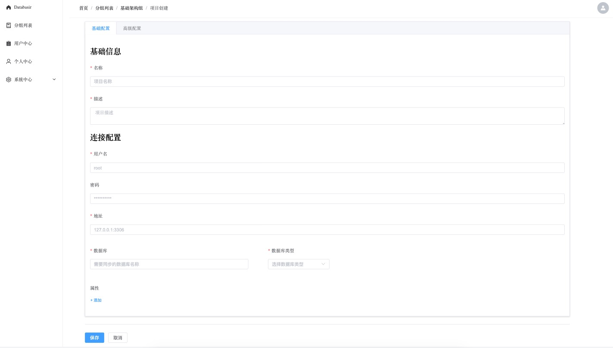
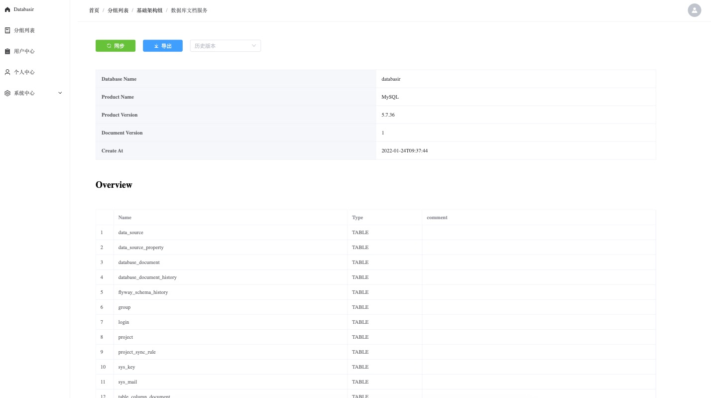
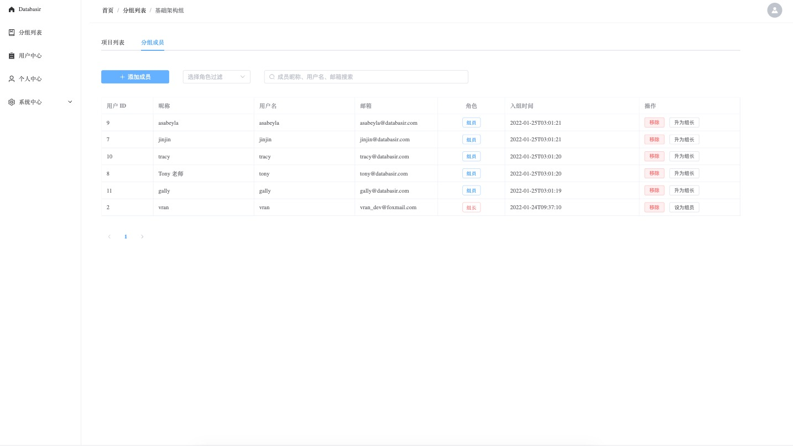
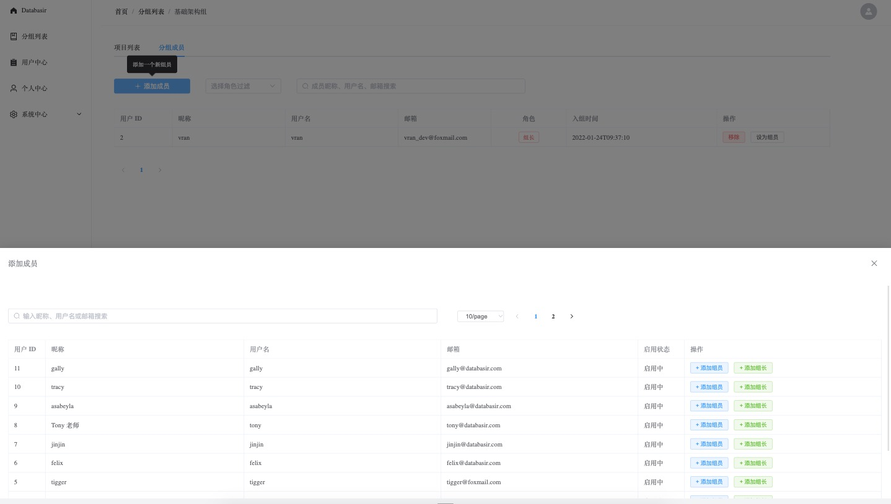
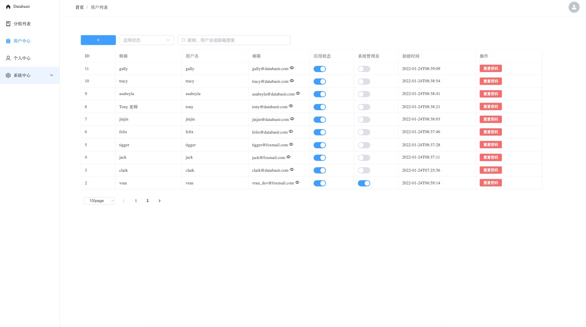
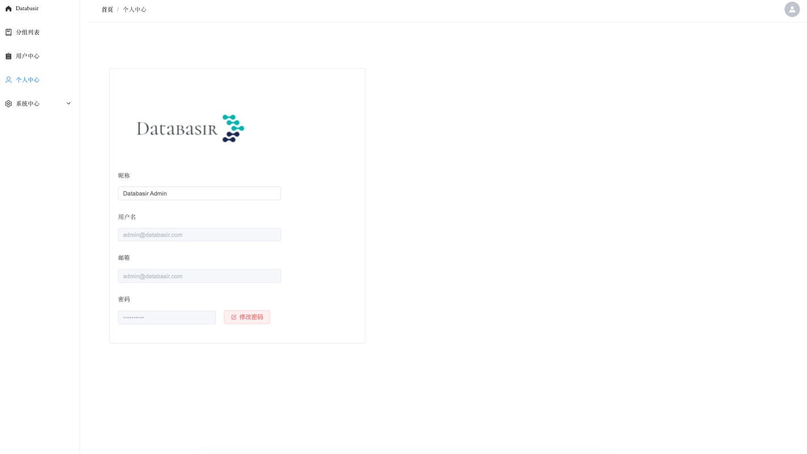
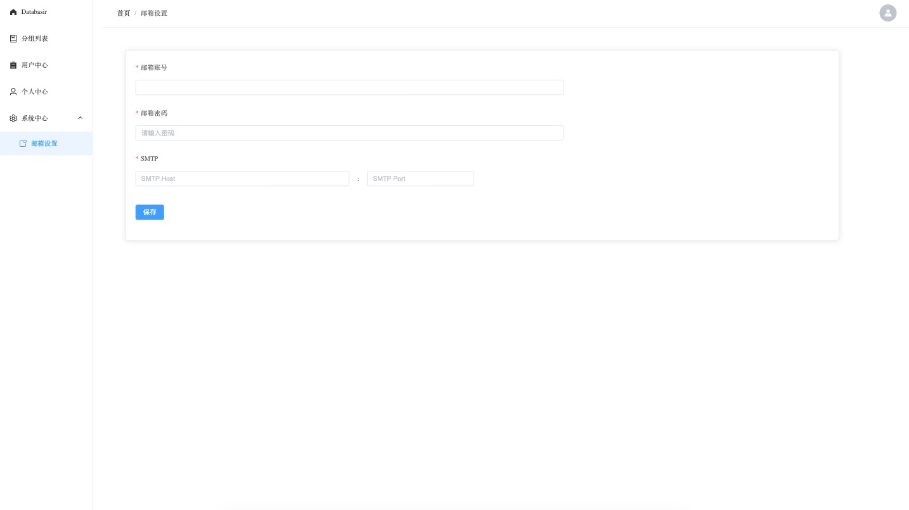

# Databasir
## 规划
项目目前还属于 MVP （可行性验证）阶段，功能、文档等尚未完备，功能也处于随时调整的阶段

以下功能尚在开发中

- [ ] 定时文档同步
- [ ] 表字段协同注释
- [ ] 操作审计日志
- [x] 容器化部署

## 简介

**Databasir** 是一款在线数据库文档管理工具，为企业开发中最核心的数据库结构提供文档化管理支撑能力

1. 自动化：定时、手动同步数据库结构并生成文档
2. 版本化：历史变更版本皆可查看
3. 精细化：团队成员可以协同为文档做更精细化的注释
4. 扁平化：权限管理扁平，减少冗余流程，价值最大化

## 部署 TODO

Databasir 采用了前后端分离的模式进行开发和部署，前端和后端需要独立部署

- 后端应用： https://github.com/vran-dev/databasir
- 前端应用： https://github.com/vran-dev/databasir-frontend

## 展示

- 首页

- 项目中心

- 项目创建

- 项目文档

- 分组成员

- 添加成员

- 用户中心

- 个人中心

- 系统邮件

