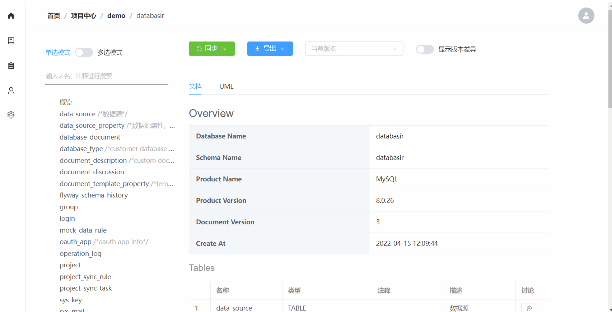
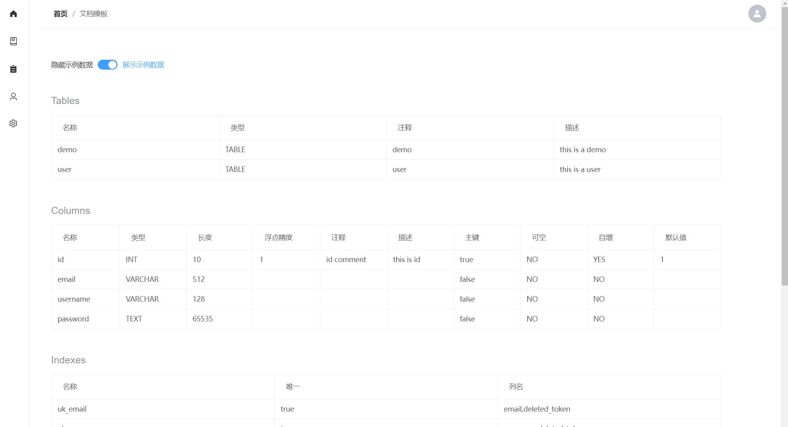
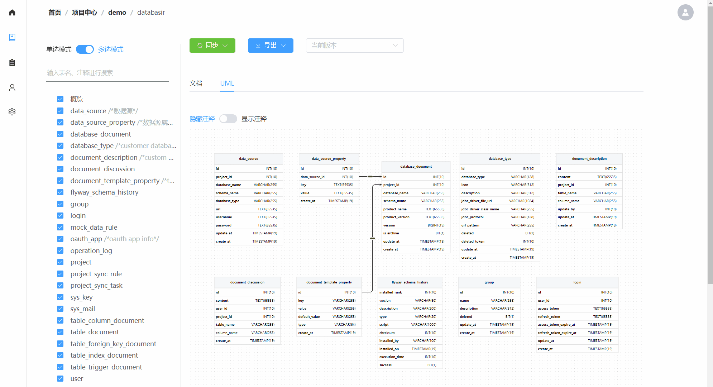
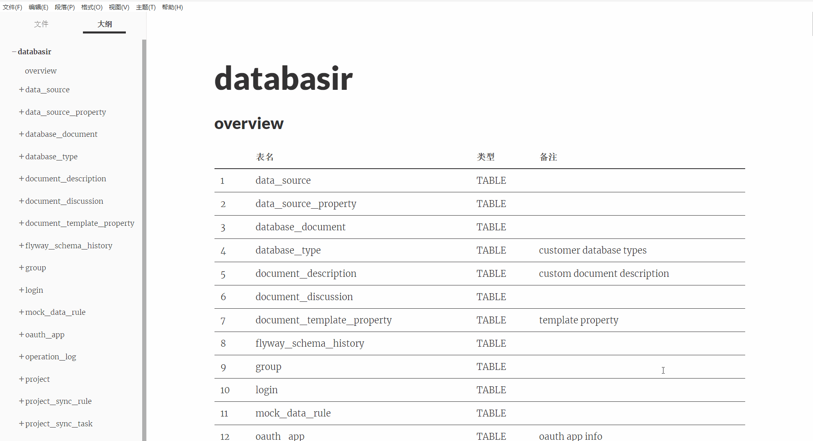

    

## 简介

 是面向团队的**关系型数据库模型文档管理平台**，旨在通过自动化的方式解决模型文档管理过程中维护成本高、内容更新不及时以及团队协作复杂等问题。

平台文档：https://doc.databasir.com

问题反馈：https://github.com/vran-dev/databasir/issues

平台演示：[https://demo.databasir.com](http://121.4.67.27/)

| 账号 | 密码    | 角色       |
| ---- | ------- | ---------- |
| demo | demo123 | 系统管理员 |
| dev  | dev123  | 普通       |

如果您有任何的问题、建议，欢迎进群讨论

当然您也可以通过公众号给我留言

实在不行，给我发邮件也行：vran_dev@foxmail.com

## 特性

1. 兼容市面多数数据库：支持所有拥有 JDBC 驱动的数据库，mysql、postgresql 开箱即用
2. 丰富的文档管理功能：支持文档自动同步，版本历史回溯，版本差异对比，文档讨论，UML 生成， 文档导出，数据 SQL 生成等，应有尽有
3. 面向团队的协作能力：扁平化的角色管理，支持 Github \ Github Enterprise \ Gitlab 的 OAuth2 登录，日志审计

## 多图展示

- 文档同步

- 文档模板定义

- 版本差异对比

- UML 图片导出

- 导出 Markdown 格式展示

## License

Apache License 2.0