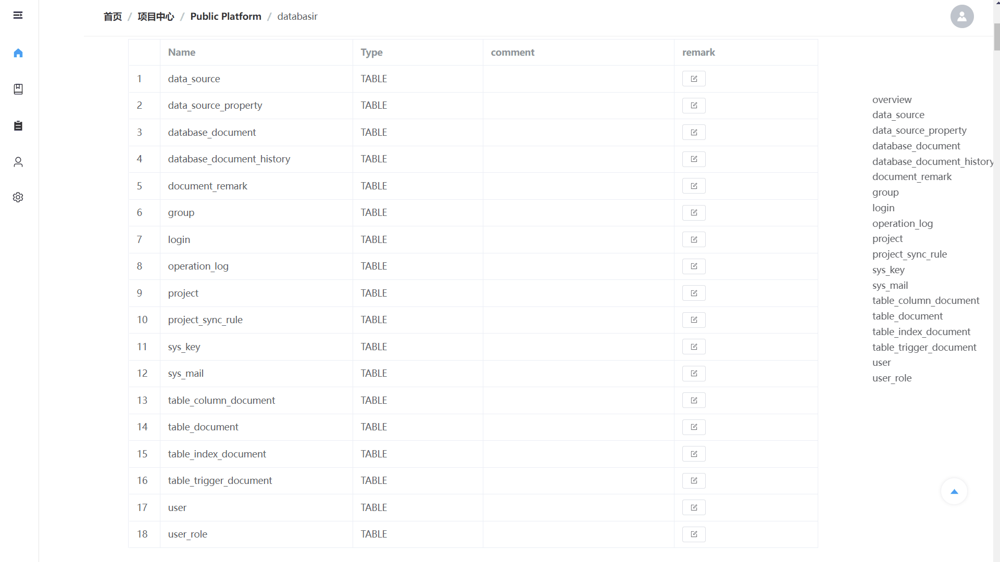
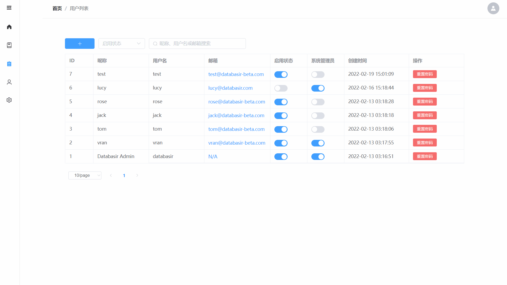

# Databasir

## 文档索引

- [项目简介](#)
- [部署指引](README/deploy.md)
- [构建指引](README/build.md)

## 简介

**Databasir** 是一款集中式的数据库文档管理工具，提供了自动化、版本化、扁平化的数据库文档管理能力，主要功能如下

1. 支持多种数据库
1. 自动或手动同步数据库 Schema 并生成文档
2. 项目 Schema 历史版本文档查看
3. 项目文档导出，提供 markdown、excel（研发中） 等格式
4. 团队管理、成员管理一应俱全，扁平化的权限管理模式
5. 安全系数高：数据库密码加密存储，存储后不会再返回前端

## 支持数据库

1. - [x] Mysql
2. - [x] Postgresql
3. - [ ] Oracle
4. - [ ] SqlServer

## 功能规划

- [x] 用户操作审计日志
- [x] 文档自动同步日志
- [ ] Excel 文档导出
- [x] Markdown 文档导出

## 展示

- 分组创建

- 项目创建

- 项目同步

- 项目批注

- 分组成员

- 用户创建

- 用户详情

- 操作日志

