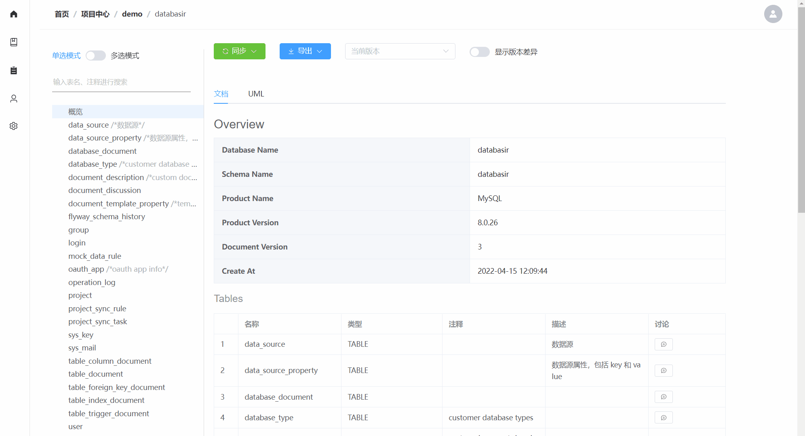
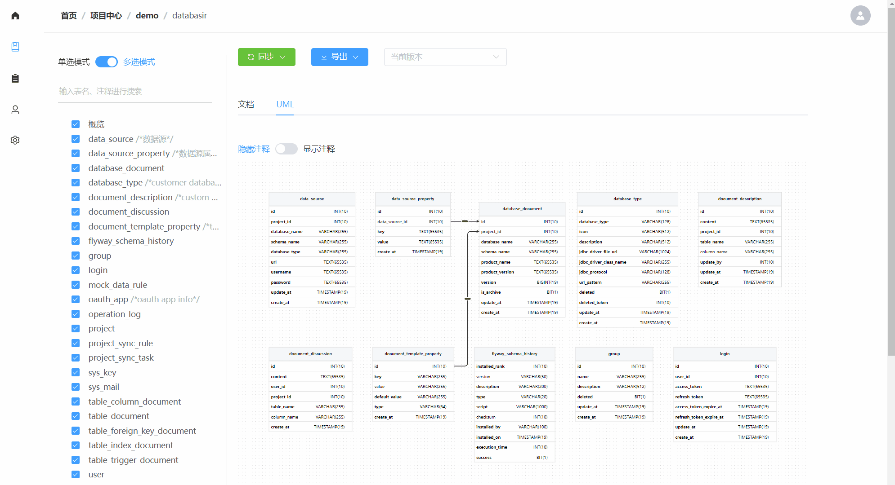
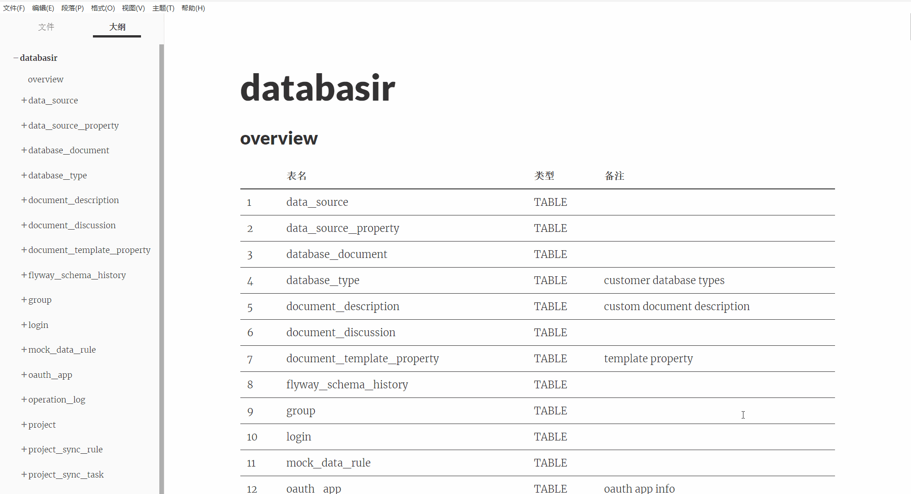

    

## 简介

 是面向团队的**关系型数据库模型文档管理平台**，旨在通过自动化的方式解决模型文档管理过程中维护成本高、内容更新不及时以及团队协作复杂等问题。

平台文档：https://doc.databasir.com

问题反馈：https://github.com/vran-dev/databasir/issues

平台演示：[~~https://demo.databasir.com~~](http://demo.databasir.com)

| 账号 | 密码    | 角色       |
| ---- | ------- | ---------- |
| demo | demo123 | 系统管理员 |
| dev  | dev123  | 普通       |

## 支持平台

理论上支持拥有 JDBC 驱动的任何数据库，以下是社区内已验证过的数据库

- MySQL
- PostgreSQL
- Oracle
- SqlServer
- 达梦
- TIDB
- Hive
- Clickhouse
- MariaDB
- .....

注意：以上列表是目前社区已经验证过的，并不代表 [Databasir](https://github.com/vran-dev/databasir) 只支持这些。

## 联系我

微信扫码加入 Databasir 交流群，获取第一手版本内容。

[点击查看更多联系方式](https://doc.databasir.com/#/?id=联系)

## 多图展示

- 文档同步

- 版本差异对比

- UML 图片导出

- 导出 Markdown 格式展示

## 捐赠

## License

Apache License 2.0