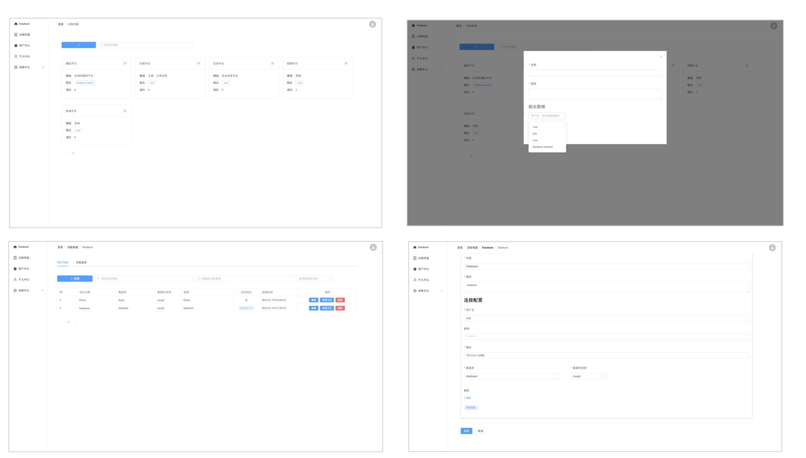
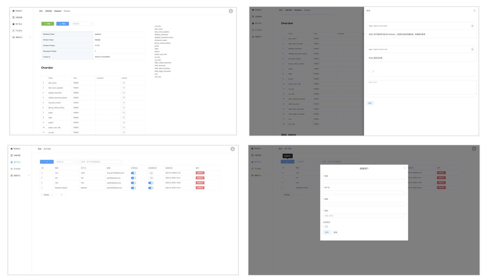

# Databasir

## 规划
项目目前还属于 MVP （可行性验证）阶段，版本功能迭代较快

以下功能尚在开发中

- [ ] 操作审计日志
- [ ] 文档导出功能
- [ ] 数据库动态扩展
- [ ] 忘记密码

目前已支持 MySQL，Postgresql 两款数据库，文档转换基于 JDBC 开发，理论上支持所有有 JDBC 驱动的数据库。


## 简介

**Databasir** 是一款集中式的数据库文档管理工具，提供了自动化、版本化、扁平化的数据库文档管理能力

1. 自动化：定时、手动同步数据库结构并自动生成文档
2. 版本化：每一次同步的文档版本皆可回溯
3. 扁平化：权限管理兼顾完备与简单，信息传输价值最大化


## 部署

Databasir 采用了前后端分离的模式进行开发和部署，前端和后端可以独立部署

- 后端应用： https://github.com/vran-dev/databasir
- 前端应用： https://github.com/vran-dev/databasir-frontend

### JAR 模式部署

注意：

1. 使用 JAR 模式部署需要系统环境有 Java 环境，**要求最低版本为 Java11**。
2. 应用使用 MYSQL 作为数据存储，需要准备好数据库。

部署：
1. 在 [Github RELEASE](https://github.com/vran-dev/databasir/releases) 页面下载最新版应用 Databasir.jar (你也可以选择克隆项目后自行构建)
2. 将 Databasir.jar 上传到服务器
3. 在 Databasir.jar 所在目录创建 config 目录，并在目录下创建 `application.properties` 配置，配置中配置 MYSQL 的用户名、密码和连接

```properties
# 端口号，默认8080
server.port=8080
# 数据库用户名
databasir.datasource.username=root
# 数据库密码
databasir.datasource.password=123456
# 数据库地址
databasir.datasource.url=127.0.0.1:3306
```

4. 通过 java -jar Databasir.jar 启动应用即可

应用启动后会默认创建 Databasir 管理员用户

- 用户名：databasir
- 密码：databasir

通过该账号登录应用既可以进行管理

### Docker 部署

TODO

## 展示

- 分组管理、项目管理



- 文档页面、用户管理页面

