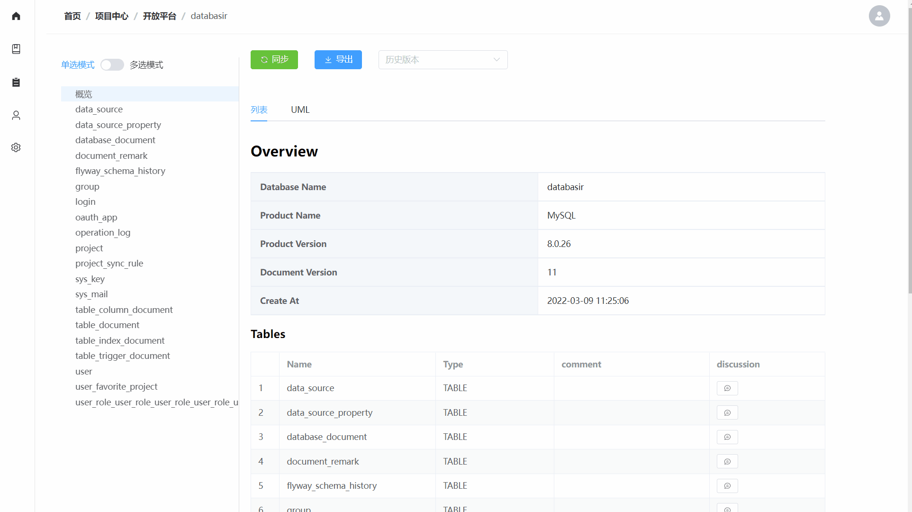
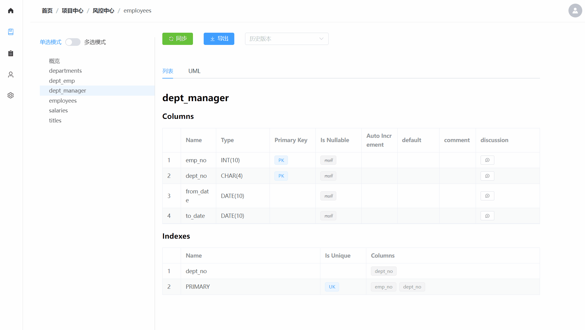
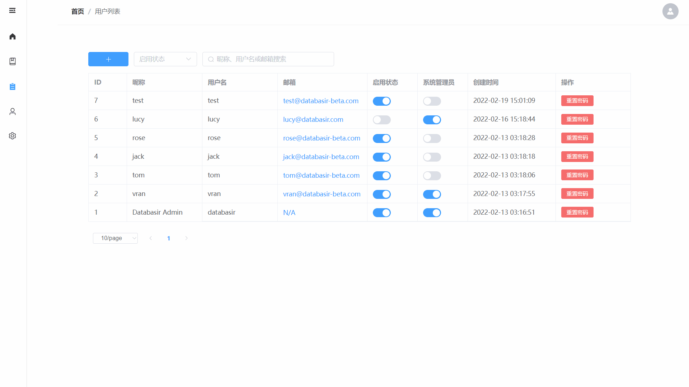

# 简介

**Databasir** 是一款集中式的数据库文档管理工具，提供了自动化、版本化、扁平化的数据库文档管理能力，主要功能如下

1. 支持所有实现 JDBC 协议的数据库（如 mysql、postgresql、sqlserver等）
2. 支持 Markdown 文档、Excel 文档(TODO)、UML 图片导出
3. 支持 Github / Github Enterprise / Gitlab 的 OAuth2 登录配置
4. 支持文档自动同步、历史版本查看、团队讨论、字段描述等
5. 扁平化的团队管理模式，灵活适应不同团队组织架构

## 功能规划

- [x] 用户操作审计日志
- [x] 文档自动同步日志
- [ ] Excel 文档导出
- [x] Markdown 文档导出
- [x] Github OAuth2 登录模式
- [x] Gitlab OAuth2 登录模式
- [x] 模型 UML 生成
- [x] UML 图片导出

## 功能展示

- 文档页面

- 分组创建

- 项目创建

- 项目同步

- 协作讨论

- 分组成员

- 用户创建

- 用户详情

- 操作日志

