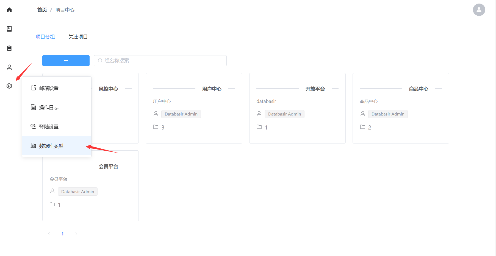
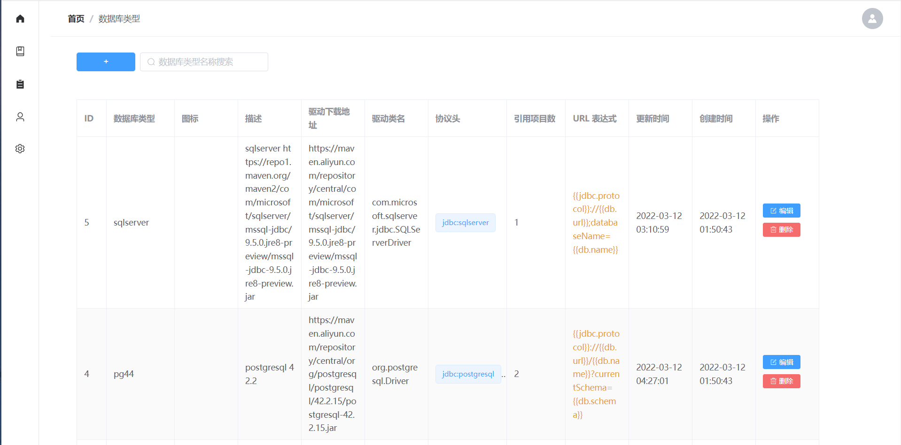
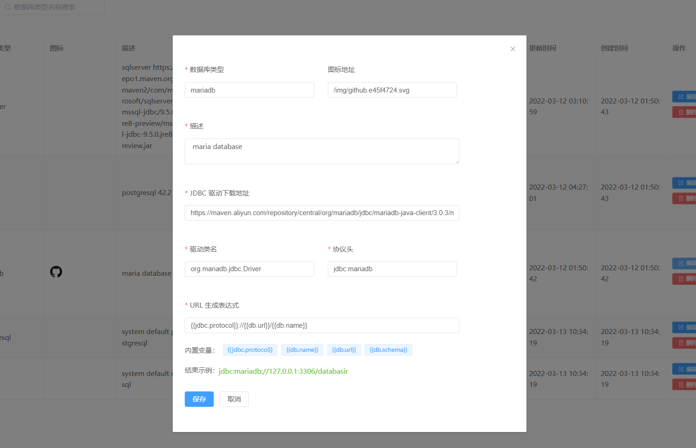
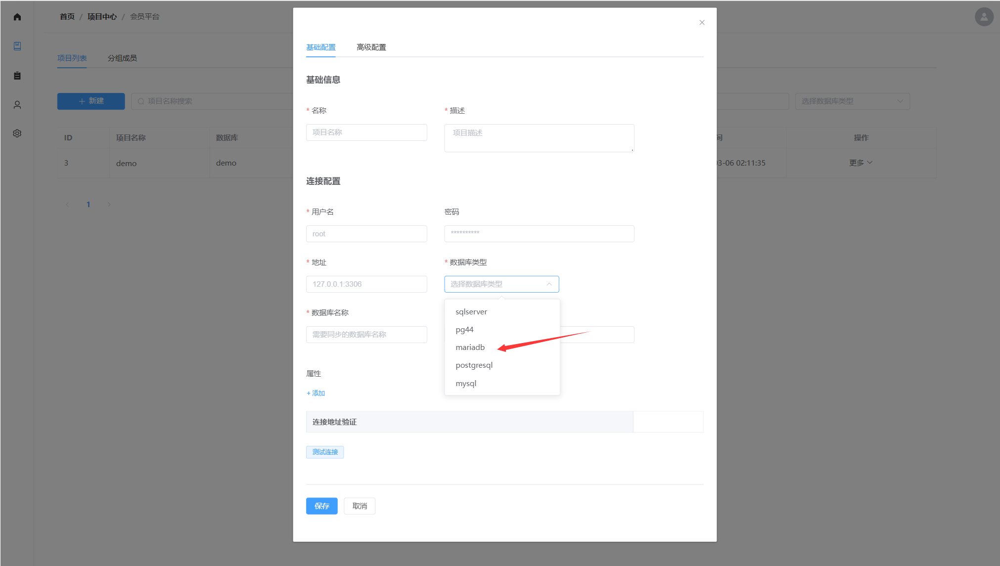

# 零代码扩展受支持的数据库类型

## 说明

[Databasir](https://github.com/vran-dev/databasir) 理论上是支持所有**拥有 JDBC 驱动的数据库**，系统已为 Mysql、Postgresql 提供了内置的支持，这两种数据库可以开箱即用。

默认配置

| 数据库类型 | 驱动版本 | 驱动类名                 |
| ---------- | -------- | ------------------------ |
| mysql      | 8.0.27   | com.mysql.cj.jdbc.Driver |
| postgresql | 42.3.1   | org.postgresql.Driver    |

对于其它数据库（有 JDBC 驱动）或者你想切换不同版本的内置数据库驱动，只需要简单的配置就可以实现

## 配置

由于数据库类型是全平台可用的，所以限制了只有【系统管理员】权限才能新增数据库类型。

通过菜单我们进入【数据库类型】配置页面

在该页面我们可以看到既有的数据库类型信息，点击左上角的 + 号就可以进入新增页面

这个表单中我们需要填入一些必要的信息，我们以扩展一个 mariadb 为例

| 属性              | 说明                                                         | 示例数据                                                     |
| ----------------- | ------------------------------------------------------------ | ------------------------------------------------------------ |
| 数据库类型        | 这是你自己定义的名称，最好是能见名知意，改名字在整个系统内不能重复。创建项目时的数据库类型会展示该名称。 | mariadb                                                      |
| 图标地址          | 用于展示图标                                                 |                                                              |
| 描述              | 对该数据库类型的一些说明                                     | maria database                                               |
| JDBC 驱动下载地址 | 系统会从改地址去下载对应的驱动，如果填入的时 maven 仓库，建议选择国内的镜像仓库，如阿里云、公司私服等。 | https://maven.aliyun.com/repository/central/org/mariadb/jdbc/mariadb-java-client/3.0.3/mariadb-java-client-3.0.3.jar |
| 驱动类名          | 比如 mysql 老版本的类名就是 `com.mysql.jdbc.Driver`          | org.mariadb.jdbc.Driver                                      |
| 协议头            | 创建连接时的协议头，比如 mysql 就是 `jdbc:mysql`             | jdbc:mariadb                                                 |
| URL 生成表达式    | 大部分数据库连接的格式是规范的，但也有少部分我们需要自定义连接 URL，而该表达式就定义了连接的模板，系统会基于该模板生成最终的连接。通常情况下我们不需要去修改默认表达式 | 默认                                                         |

表达式内置变量

- {{jdbc.protocol}} 对应表单中填写的协议头
- {{db.name}} 对应创建项目时填写的数据库名称
- {{db.schema}} 对应创建项目时填写的 schema名称
- {{db.url}} 对应创建项目时填写的 url

## 验证

保存完成以后我们就可以在项目创建页面找到我们自定义的数据库示例了

