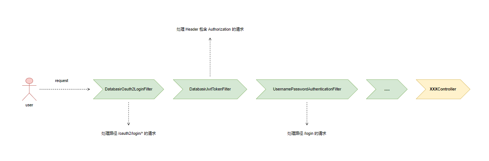

# 用户名密码登录解析

## 相关代码位置

相关代码都位于 `API` 模块下的 

- 【package】com.databasir.api.config.security.*
- 【class】com.databasir.api.config.SecurityConfig.java 


## 登录认证过滤器

Databasir 的登录认证都是在 Filter 中实现的，目前有两个自定义的 Filter

- `DatabasirOauth2LoginFilter`：负责处理 OAuth2 登录的请求
- `DatabasirJwtTokenFilter`：负责验证登录凭证的有效性

用户名和密码的登录采用 Spring Security 自带的 Filter

- `UsernamePasswordAuthenticationFilter`：负责处理用户名密码登录的请求

用户登录请求都会经过这三个过滤器



由于本篇主要说明用户明密码登录这一流程，所以会重点专注于 `UsernamePasswordFilter` 这一过滤器。

## 登录认证相关类

用户名密码登录是基于 Spring Security 提供的  `UsernamePasswordAuthenticationFilter` 实现。

Databasir 根据该过滤器的扩展点自定义了以下类

- DatabasirAuthenticationFailureHandler：登录失败回调
- DatabasirAuthenticationSuccessHandler：登录成功回调
- DatabasirUserDetailService：获取用户登录信息的 service
- DatabasirUserDetails：用户的登录信息（扩展了角色信息）

这些类的装配都在 `com.databasir.api.config.SecurityConfig.java` 中，下面展示了一部分源码，重点关注 `configure(HttpSecurity)` 方法

```java
@Configuration
@RequiredArgsConstructor
@EnableGlobalMethodSecurity(prePostEnabled = true)
public class SecurityConfig extends WebSecurityConfigurerAdapter {

    private final DatabasirUserDetailService databasirUserDetailService;

    private final DatabasirAuthenticationEntryPoint databasirAuthenticationEntryPoint;

    private final DatabasirJwtTokenFilter databasirJwtTokenFilter;

    private final DatabasirAuthenticationFailureHandler databasirAuthenticationFailureHandler;

    private final DatabasirAuthenticationSuccessHandler databasirAuthenticationSuccessHandler;

    @Override
    protected void configure(HttpSecurity http) throws Exception {
        http.headers().frameOptions().disable();
        http.csrf().disable();
        http.cors();

        http.sessionManagement().sessionCreationPolicy(SessionCreationPolicy.STATELESS)
                .and()
                // 启用 form 表单登录方式，配置登录地址为 /login，并制定成功和失败的回调处理类
                .formLogin()
                .loginProcessingUrl("/login")
                .failureHandler(databasirAuthenticationFailureHandler)
                .successHandler(databasirAuthenticationSuccessHandler)
                .and()
                .authorizeRequests()
                // 登录和 Token 刷新无需授权
                .antMatchers("/login", Routes.Login.REFRESH_ACCESS_TOKEN)
                .permitAll()
                // oauth 回调地址无需鉴权
                .antMatchers("/oauth2/apps", "/oauth2/authorization/*", "/oauth2/login/*")
                .permitAll()
                // 静态资源无需鉴权
                .antMatchers("/", "/*.html", "/js/**", "/css/**", "/img/**", "/*.ico")
                .permitAll()
                // api 请求需要授权
                .antMatchers("/api/**").authenticated()
                .and()
                .exceptionHandling()
                .authenticationEntryPoint(databasirAuthenticationEntryPoint);

        http.addFilterBefore(
                databasirJwtTokenFilter,
                UsernamePasswordAuthenticationFilter.class
        );
    }

    @Override
    protected void configure(AuthenticationManagerBuilder auth) throws Exception {
        // 这里指定了 userDetailService 为自定义的 DatabasirUserDetailService
        auth.userDetailsService(databasirUserDetailService)
                .passwordEncoder(bCryptPasswordEncoder());
    }

}
```


## 登录认证过滤器处理流程

当请求经过 `UsernamePasswordAuthenticationFilter` 时，该过滤器会校验请求的路径是否是 `/login` ，如果不是的话就直接放行。

然后在从请求参数里面获取用户名和密码

- username
- password

再之后使用 `DatabasirUserDetailsService` 根据用户名获取实际的用户信息，将实际的密码和登录时传的参数做比较

- 如果不一致就登录失败，调用  `DatabasirAuthenticationFailureHandler`
- 如果一致就说明登录成功，调用 `DatabasirAuthenticationSuccessHandler`

下图展示了一个简化的代码调用时序


## 登录成功回调

当用户名密码认证通过以后就会触发**登录成功回调**（代码实现在`DatabasirAuthenticationSuccessHandler`），这里主要做一件事情

- 生成登录凭证：access_token、refresh_token

access_token 是请求接口的凭证，证明你是合法的登录用户，时效性是以分钟为单位，格式为 JWT。

refresh_token 是用于在 access_token 过期时，用于获取新的 access_token，时效性是以天为单位。

这些信息都存储在 login 表里，login 表与 user 表是一对一的关系


access_token 和 refresh_token 最终都会返回给前端，前端拿到 token 以后调用业务接口都需在请求中加入 名为 Authorization 的 Header，值为 access_token

```http
POST /api/v1.0/groups

Authorization: {{ access_token }}
```

如果 access_token 过期，前端会拿 refresh_token 获取一个新的 access_token，然后再调用业务接口，这些过程对用户是透明的。


## 登录失败回调

当用户名密码认证没通过的时候机会触发登录失败回调，源码位于 `DatabasirAuthenticationFailureHandler` 中。

失败的回调会判断异常类型做出不同的响应

- BadCredentialsException：响应 200，用户名或密码错误
- DisabledException：响应 200，用户已禁用
- DatabasirAuthenticationException：响应 200，自定义登录异常
- 其他：响应 401
