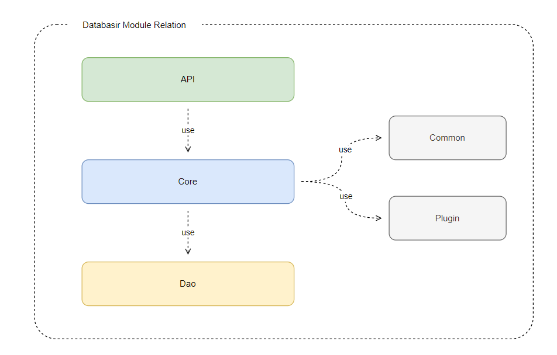

# 项目模块

Databasir 基于 Gradle 进行模块管理，当前共有 5 个模块

| 模块名称 | 职责                                                         |
| -------- | ------------------------------------------------------------ |
| api      | 所有的接口和定时任务均在该模块定义                           |
| common   | 定义了项目通用的类，比如加解密工具、业务异常、标准 HTTP 返回类型等 |
| core     | 核心业务模块，包含了所有的业务逻辑                           |
| dao      | 数据访问层，包含了数据库的实体、数据访问对象以及项目模型的 SQL 文件 |
| plugin   | jdbc 封装模块，将从 jdbc 获取的数据库元信息转换成 Databasir 的 Java 对象，文档信息的 DIFF  功能也是在该模块内实现 |

模块的依赖关系是一个简单的单向依赖




## API 模块介绍

- 代码目录

```java
api
└── src/main/java
    └── com/databasir
        ├── api
        │   ├── advice
        │   │   ├── DatabasirExceptionAdvice.java /* 业务异常切面 */
        │   │   └── OperationLogAspect.java /* 审计日志切面 */
        │   ├── common
        │   │   └── LoginUserContext.java 用户信息工具类
        │   ├── config
        │   │   ├── oauth2
        │   │   │   ├── DatabasirOAuth2Authentication.java /* oauth2 登录信息实体 */
        │   │   │   ├── DatabasirOauth2LoginFilter.java /* oauth2 登录过滤器 */
        │   │   │   └── OAuth2AuthenticationSuccessHandler.java /* oauth2 登录成功回调类 */
        │   │   ├── security
        │   │   │   ├── DatabasirAuthenticationEntryPoint.java /* 授权失败回调类 */
        │   │   │   ├── DatabasirAuthenticationFailureHandler.java /* 登录失败回调类 */
        │   │   │   ├── DatabasirAuthenticationSuccessHandler.java /* 登录成功回调类 */
        │   │   │   ├── DatabasirJwtTokenFilter.java /* jwt token 校验过滤器 */
        │   │   │   ├── DatabasirUserDetails.java /* 已登录用户实体信息 */
        │   │   │   └── DatabasirUserDetailService.java /* 加载 DatabasirUserDetails 的 service  */
        │   │   ├── SecurityConfig.java /* spring security 配置类 */
        │   │   └── WebConfig.java /* web 配置类 */
        │   ├── validator
        │   │   └── XXXXXValidator.java /* 业务规则前置校验器 */
        │   ├── XXXXXController.java /* 业务 HTTP 接口 */
        │   └── Routes.java /* 业务 HTTP 接口路径常量 */
        └── job
            ├── ProjectDocumentAutoSyncJob.java /* 文档自动同步任务 */
            └── ProjectDocumentAutoSyncTriggerJob.java /* 文档自动同步任务启用任务 */
```


- 配置目录

```java
api
└── src/main/resources
    ├── static /* 静态资源目录 */
    ├── application.properties /* 生产环境配置文件 */
    └── application-local.properties /* 本地开发配置文件 */
```

