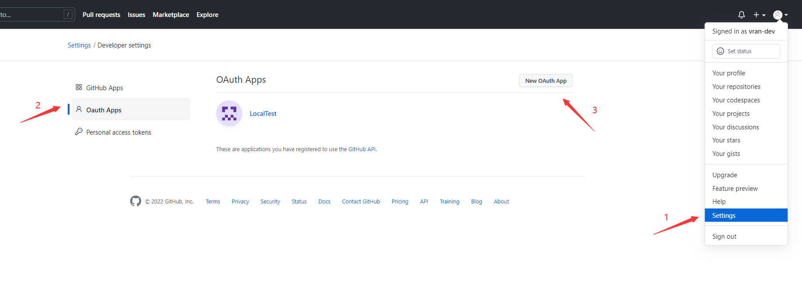
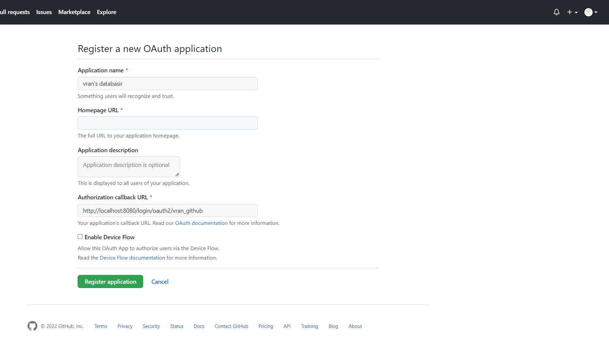
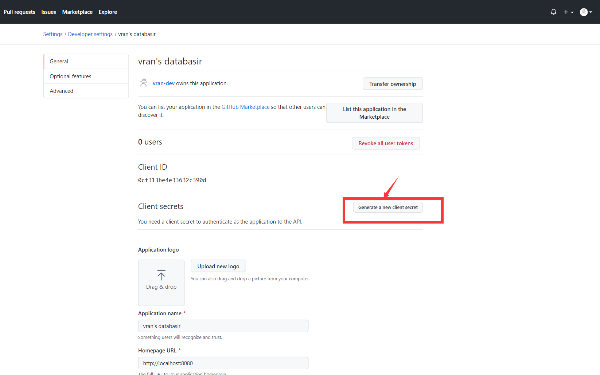
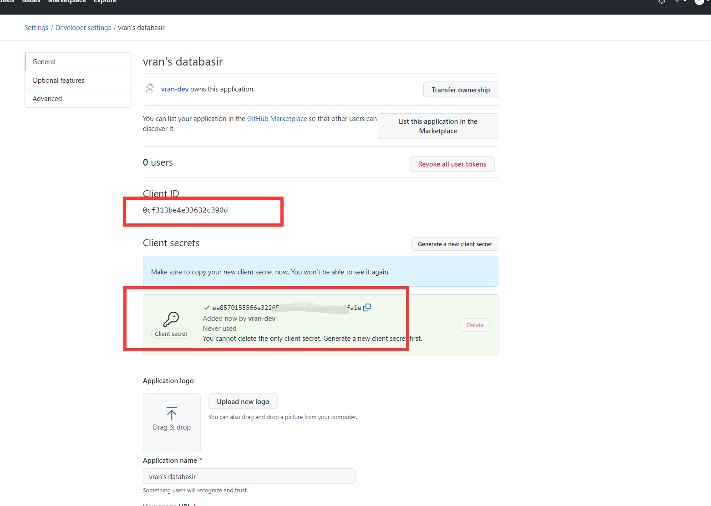
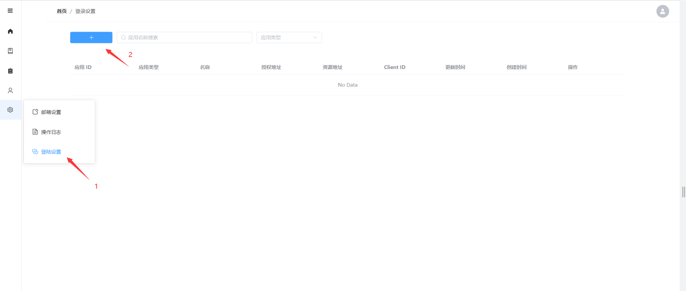
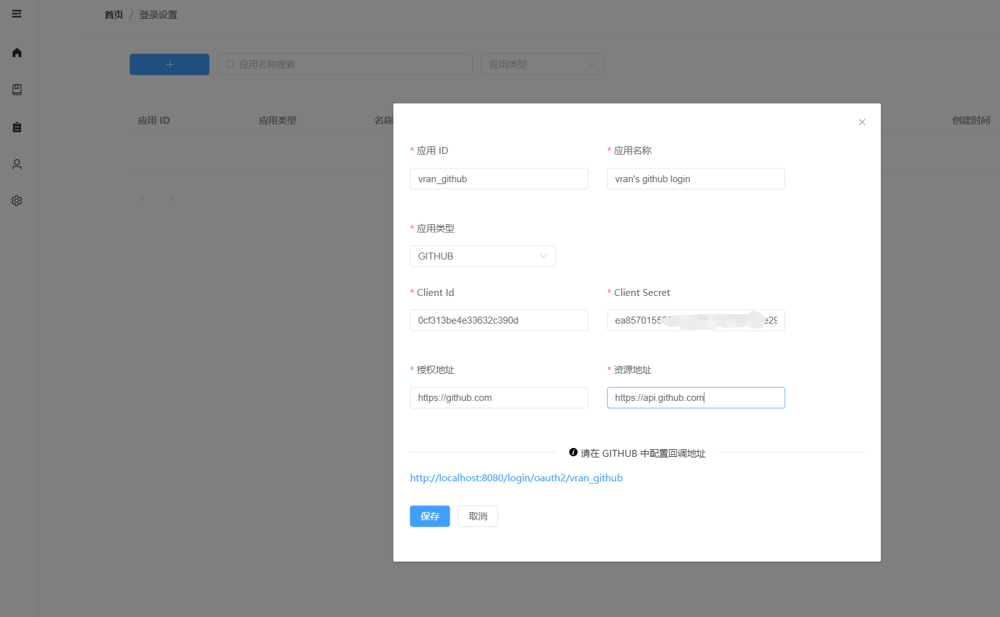
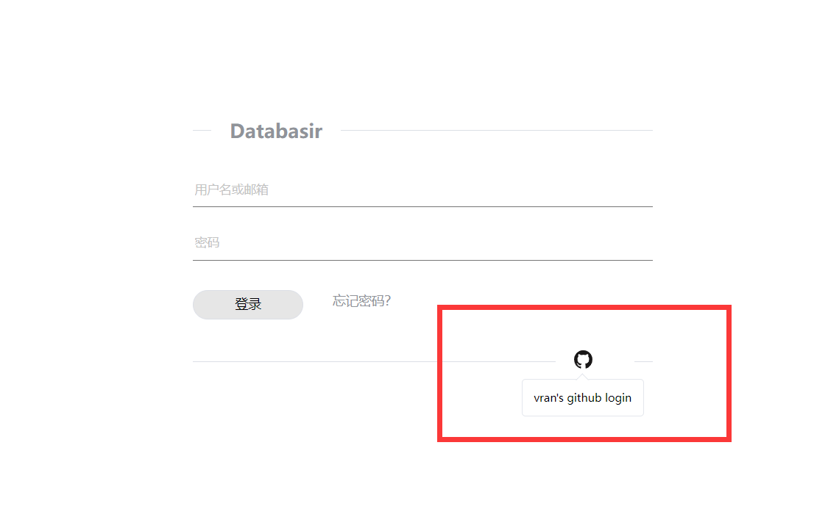
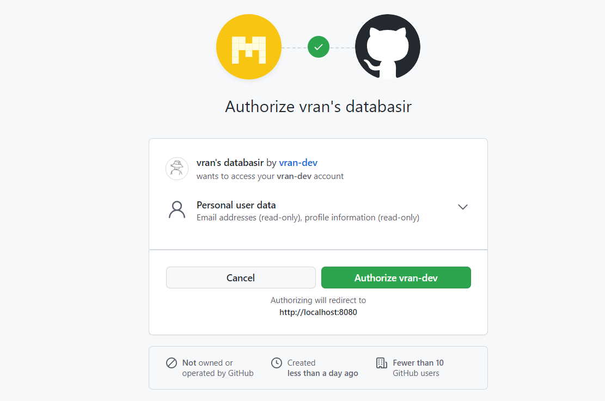

# Databasir 配置 Github OAuth2 登录

1.  **创建 Github OAuth Application**

2. **填写 Github 应用资料**

Homepage URL 填写你部署 databasir 后，可访问的公网域名。

Authorization callback URL 你可以先填写  {{ databasir 域名 }}/login/oauth2/{{ registrationId }}，这里的 registrationId 你可以任意填写，只需要稍后在 Databasir 中配置时保持一致即可，我这里填写了 vran_github

3. 申请 client secret

点击 `Generate a new client secret`，生成秘钥以后记得复制暂存一下，以后是看不见原始秘钥的了

4. 保存 Client Id 和刚刚生成的 Client Secret

5. 进入 Databasir 系统管理 -> 登录设置

6. 最后一步，创建并保存登录应用

还记得我在第 2 步时候说的 `registrationId`  吗？那个就对应 databasir 中的 `应用 ID` ，只要两者保持一致就可以成功接受 github 的回调，要是前面配错了也可以在当前页面复制自动生成的 URL 去 github 重新填写 Authorization callback URL 就可以了。

注意授权地址和资源地址

- 授权地址：获取 access_token 的请求地址
- 资源地址：获取用户信息的请求地址

这里填写不一样是因为 github 官方将授权和资源地址分开的，如果你使用的时 github enterprise 版本，授权地址和资源地址其实是一样的。

配置完成以后，注销登录后再次进入登录页面就会发现多了一个 github 的小图标，点击就可以使用 github 进行登录

点击就会进入授权页面，授权完成就会创建一个新的 databasir 用户，并直接登录成功

