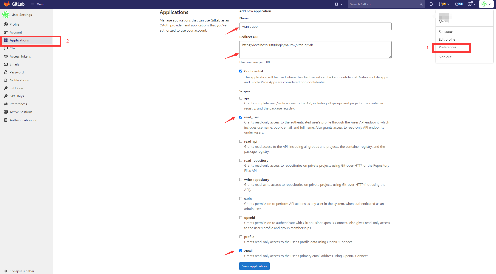
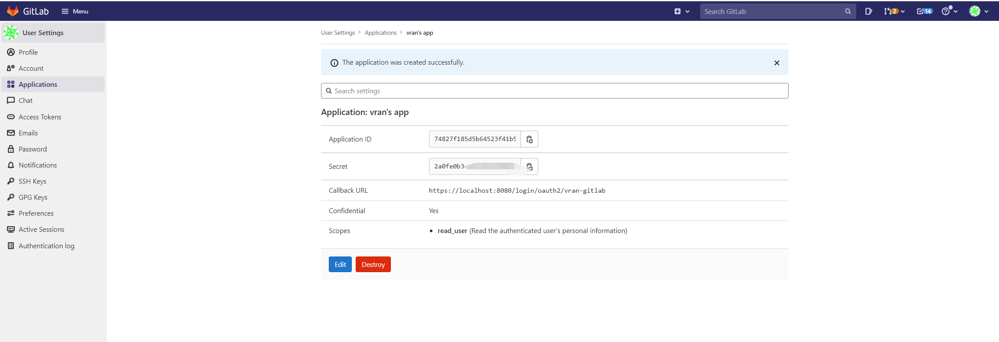
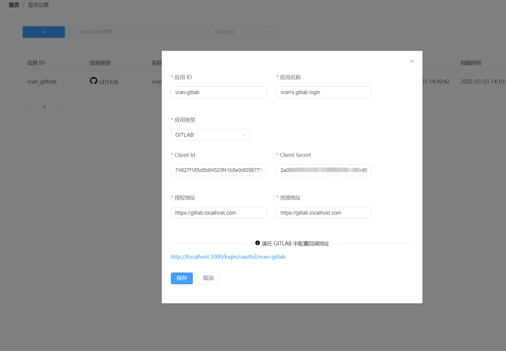
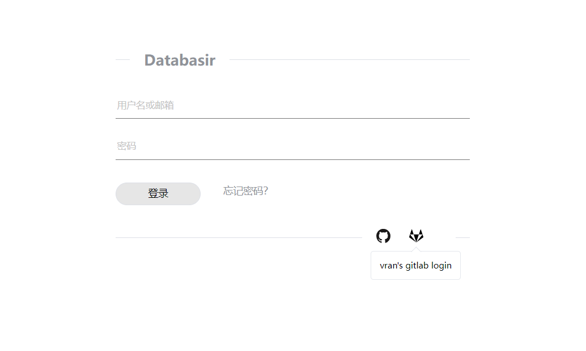
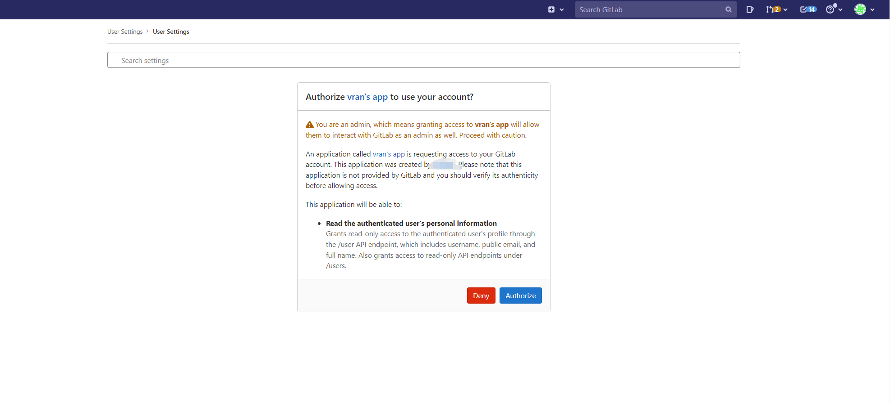

# Databasir 配置 Github OAuth2 登录

1.  创建 Gitlab 应用，填写应用名称、回调地址等信息，注意下面授权一定记得勾选上 **read_user**

回调地址填写你访问 databasir 的公网地址 {{ databasir 地址 }}/login/oauth2/{{ 应用ID }}

这里我的应用 id 为 vran-gitlab，后面在 databasir 配置的时候需要用上

2. 保存好应用以后，就可以看见 Application Id 和 Secret，复制这两个值

3. 进入 Databasir 系统管理 -> 登录设置页面

4.  创建并保存应用信息

- client Id 就对应申请到的 Application Id

- client secret 就对应申请到的 Application secret
- 应用 id 记得和我们第一步填写 redirect uri 时的应用 id 保持一致

5. 保存完成以后注销登录，进入登录页面就可以看见多了一个 gitlab 的登录图标，点击就可以使用 gitlab 来登录了

注意：如果登录出现 The redirect URI included is not valid. 这样的错误，请检查回调地址是否与 databasir 的地址一致，以及协议是否一致（比如 http 和 https）。

点击登录以后就会进入授权页面，授权完成以后就会新建一个 databasir 用户并自动完成登录

