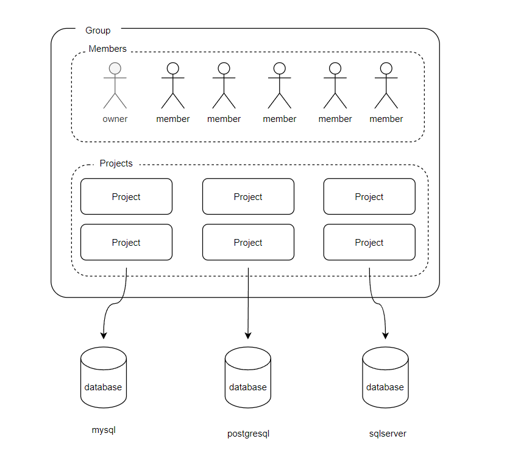
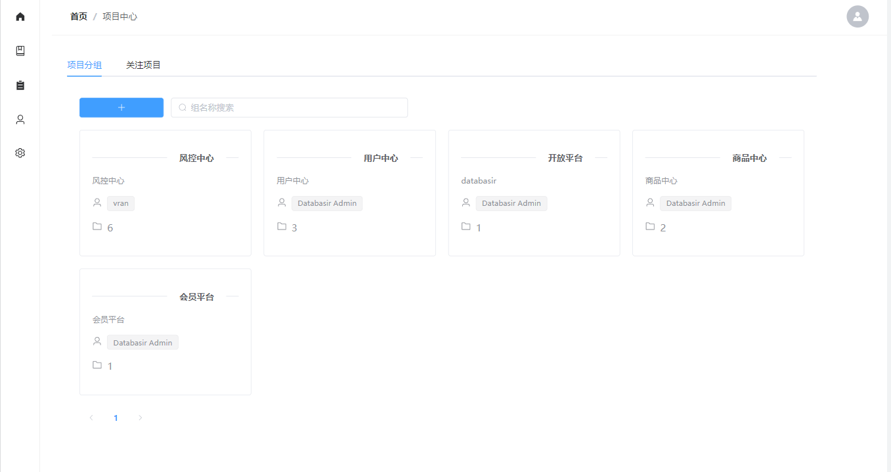
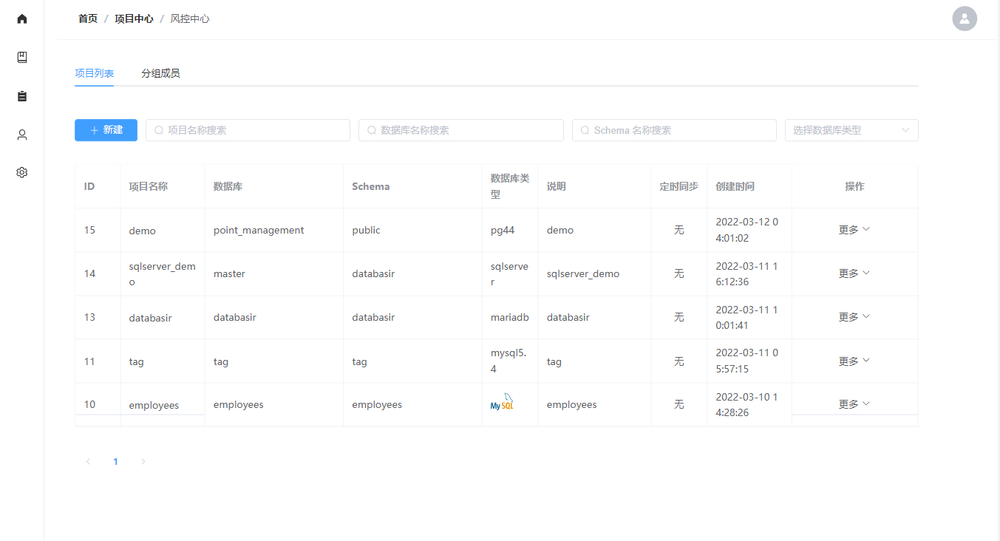

# 分组与项目

分组（Group）和项目（Project）是 Databasir 中最基础的概念，它们之间的关系如下图所示

## 分组（Group)

分组是由项目和成员共同组成，它们之间有着非常明确对应关系

- 一个分组下有多个成员（用户）
- 一个分组下有多个项目

每个成员（用户）在所属分组可以承担两种角色，分别是

- 组长：拥有该分组下的所有读写权限
- 组员：拥有该分组下的部分写权限，全部读权限

对于每个用户来说，他可以加入多个分组，在不同的分组承担不同的角色。

Databasir 并没有将分组和企业中的组织或开发中的环境做强行的绑定，你可以灵活的使用它，推荐的做法是

- 如果你的项目数不多，可以使用分组作为环境管理，比如创建 dev、qa、prod 三个分组
- 如果你所在团队很大，可以将分组对应到不同的业务线，比如公共设施组、电商平台组、物流平台组等

## 项目（Project)

`Database per Project` 是 Databasir 中的基本概念，见名知意，也就是一个项目其实对应一个数据库。

项目必须建立在某个指定的分组下面，不能独立存在，它是 Databasir 管理的最小单位，主要维护了以下信息

- 对应数据库的连接信息
- 文档同步规则，比如：字段过滤条件、定时同步时间等
- 数据库模型文档所有历史版本数据
- 数据库模型文档的讨论

项目支持手动和自动同步，每次同步时 Databasir 会与项目当前最新版本文档做对比，如果没有结构变更，则不会生成新的版本。
