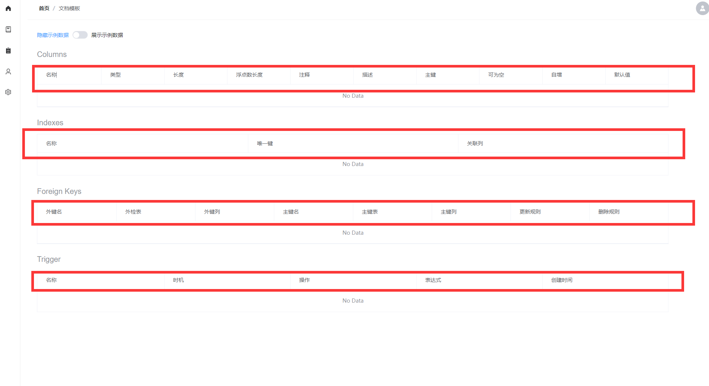
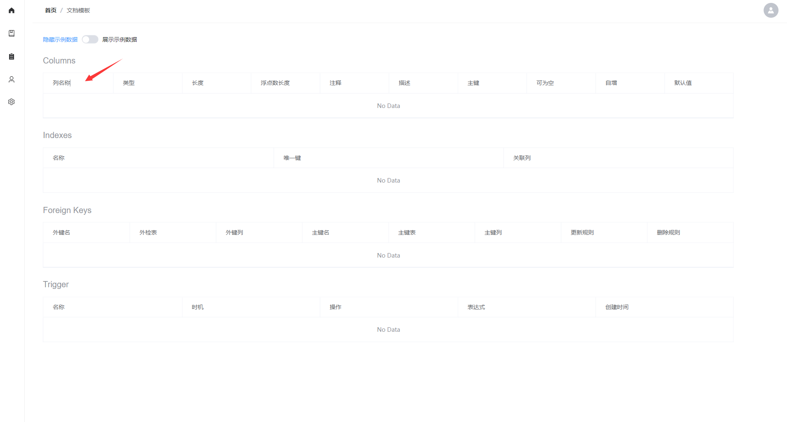

## 文档导出

Databasir 支持多种类型的文档格式导出，该功能位于文档详情页面to，通过项目列表中点击指定项目的**查看文档**进入

进入文档页面以后，鼠标指向**导出**按钮即可显示出目前支持的文档导出格式

## 版本差异对比 

如果成功同步了多个版本的文档，你可以随意的选择版本进行差异对比。

在文档页面，点击**显示版本差异**按钮

启用以后会出现一个对比版本的下拉框，选择我们要对比的版本，默认情况下基础版本是最新的，也就是在对比新版本比老版本有什么变化

选中版本以后就自动出现了差异标记

- 绿色：标识新增
- 红色：标识删除
- 黄色：标识修改
- 灰色：标识无变化

比如下图

- 删除了 document_remark 表
- 修改了 table_column_document、table_document 表
- 新增了 table_foreign_key_document 表

切换到修改表的地方，可以查看具体的修改内容，比如下图就展示了

- type 字段的类型由  text 改为了 varchar
- comment 字段的类型由 text 改为了 varchar

## 自定义文档表头

目前 Databasir 的文档主要是以表格形式进行内容展示，包括了一下内容

- 表信息
- 列信息
- 索引信息
- 外键信息
- 触发器信息

这其中除了表信息以外，其他的表格内容都支持自定义表头（默认表头为英文）。

该操作需要拥有系统管理员权限，操作之前需要注意表格头名称的更改是全局的，即所有的项目都会生效。

页面入口位于侧边菜单栏的**文档模板**

点击就会跳转编辑页面，在页面我们可以看见四个 Tab 页，就对应了 4 个表格的配置。

默认情况下，**值**是空的，我们可以通过填入新的名称替代默认值，比如我修改了列的字段名配置

修改完成以后记得点击保存按钮进行保存，

如果你想验证变更后的效果，可以通过预览按钮查看

