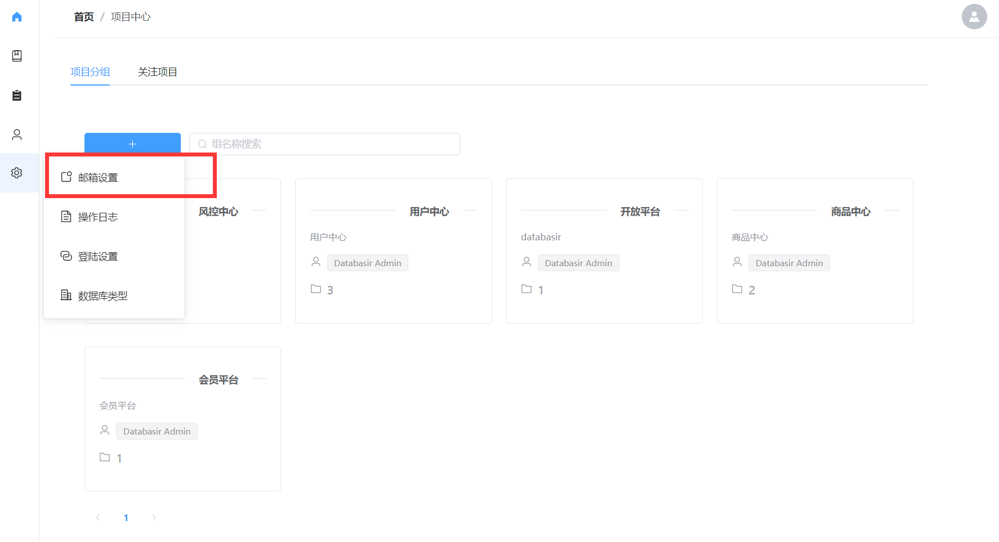
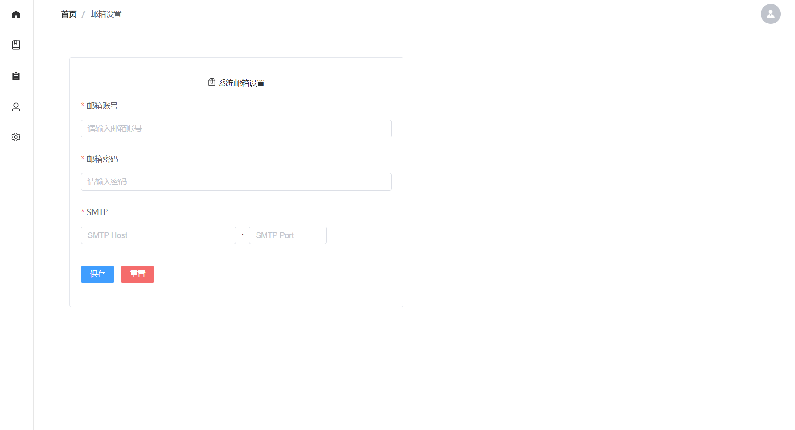

# 邮箱设置

Databasir 很多通知会通过邮件的形式进行发送，比如

- 项目版本变更
- 项目新增讨论
- 重置密码

这些通知只有在管理员为系统设置了默认邮箱时才能正常使用。

## 新增邮箱
邮箱的设置入口如下图所示

点击就可以进入邮箱配置页面，目前支持使用 SMTP 协议进行配置。

验证邮箱配置是否成功可以在用户管理列表页中点击**重置密码**，如果邮箱配置正常，那么对应用户的邮箱会收到重置后的新密码

## 重置邮箱

如果想关闭系统的推送，可以**重置邮箱**，这样系统的邮箱配置就会回到初始状态。

重置功能位于邮箱配置页面，点击**重置按钮**即可完成

