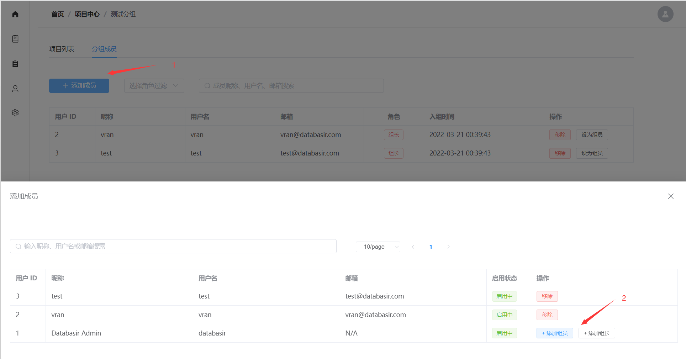

# 分组管理

如果你还不清楚 Databasir 中分组的概念，可以先阅读[分组与项目](/README/group-and-project/index.md)一节

## 创建分组

Note：**只有系统管理员才可以创建分组**

在成功登入 Databasir 后就会默认进入**分组列表页**，该页面将会以卡片的形式展示平台中已创建的所有分组。

点击左上角蓝色的 + 号就可以弹窗分组创建页，需要填写三个信息

- 名称：即列表页展示的组名
- 描述：简要描述分组信息
- 组长：该分组的负责人，支持通过名称、邮箱搜索

信息填写完成以后点击确定即可创建成功

## 删除分组

Note：只有系统管理员和组长可以删除分组

在分组列表页，将鼠标移到想要删除的分组上面就会在名称左边显现出一个编辑图标

点击该按钮进入分组编辑页

点击**确认删除分组**后再次弹出一个警告框，最终确认以后就成功删除该分组了

## 添加移除成员

Note：只有系统管理员和组长可以添加移除成员

成员的管理有两种方式

**一、在分组编辑页管理**

在分组的编辑页面上可以添加或删除组长（仅可增删组长）

添加的过程和前面创建分组时一样，在搜索框搜索用户然后点击即可添加，完成以后记得保存方可生效。

删除分组的话只需要点击组长标签右侧的 x 按钮即可，同样，完成以后记得保存方可生效。

**二、在成员管理页管理**

通过点击分组列表页中的组名可以跳转到分组详情页中，该页面有两个 Tab

- 项目列表
- 分组成员

点击分组成员即可进入成员管理 Tab 页，在该页面我们可以通过点击**移除**按钮将用户移出该分组

通过点击左上角的**添加成员**按钮就可以进入成员选择页面进行添加，可以作为组员添加，也可以作为组长添加，按需选择。

在该页面我们可以通过点击**移除**按钮将用户移出该分组。

## 修改成员角色

Note：只有系统管理员和组长可以修改成员角色

如果我们想修改一个用户在分组内的角色，只需要在分组成员 Tab 页进行切换就可以

- 如果该用户是组员，则会出现**升为组长**的按钮
- 如果该用户是组长，则会出现**设为组员**的按钮

组长拥有所属分组的所有读写权限，包括修改其他组长的角色，但是组长无法修改自己的角色