# 项目管理
如果你还不清楚 Databasir 中分组的概念，可以先阅读[分组与项目](/README/group-and-project/index.md)一节

## 创建项目

项目必须创建在指定分组下面，所以在创建项目前需要先创建分组。

在所属分组中，组员和组长都拥有创建项目的权限，在分组详情页中我们可以点击**新建**按钮开始创建项目

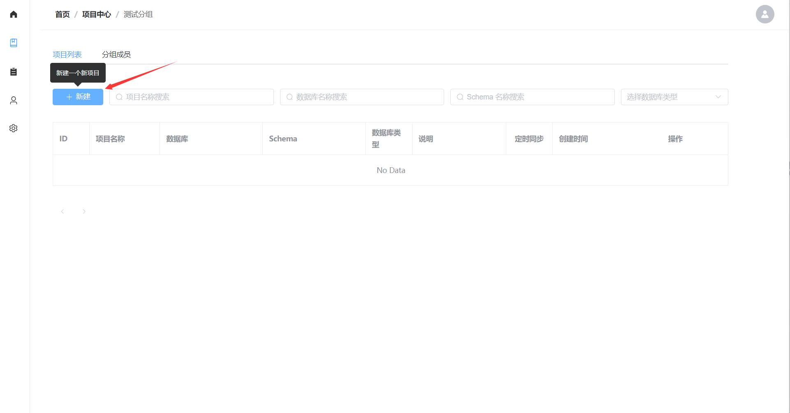

点击以后我们就可以进入项目创建表单页，页面是一个 Tab 页，有**基础配置**和**高级配置**两个 Tab

- 基础配置 Tab：项目的名称、数据库连接等配置
- 高级配置 Tab：项目的定时同步规则、忽略表和列配置

我们先只关注**基础配置**，这个页面分为两个部分

- 基础信息
- 连接配置

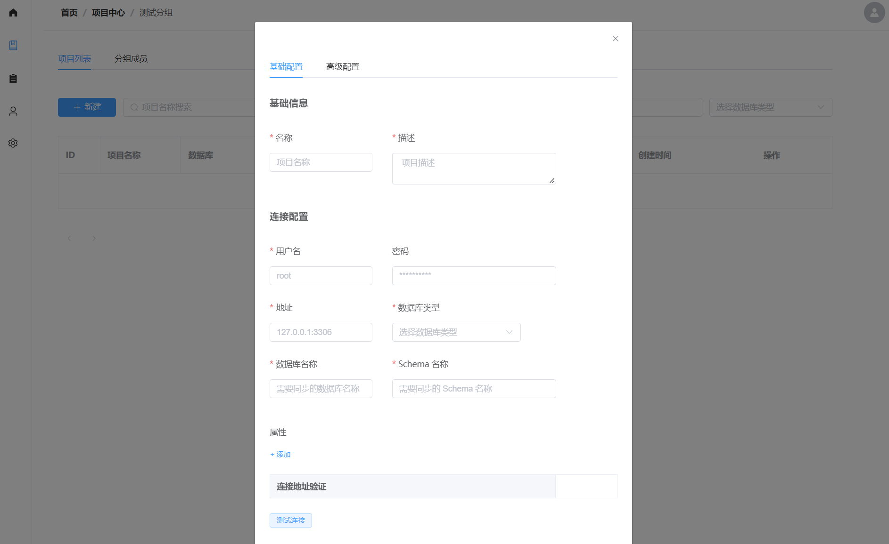

表单大部分内容都不用多说，可能数据库名称和 Schema 名称会让人有点迷惑，我以 mysql、postgresql、sqlserver 为例来说明这两者的区别

|            | 数据库名称                                          | Schema 名称                                         |
| ---------- | --------------------------------------------------- | --------------------------------------------------- |
| Mysql      | 创建数据库时指定的名称                              | 对于 Mysql 来说，schema 名称和数据库名称是一样的    |
| Postgresql | 创建数据库时指定的名称                              | 如果在 DDL 中没有指定，Postgresql 默认使用 `public` |
| Sqlserver  | 如果在 DDL 中没有指定，sqlserver 默认使用  `Master` | 创建 Schema 时指定的名称                            |

填完连接信息以后可以通过**测试连接**按钮验证是否能成功连接到数据库，当然，即使连接不成功你也可以先保存下来。

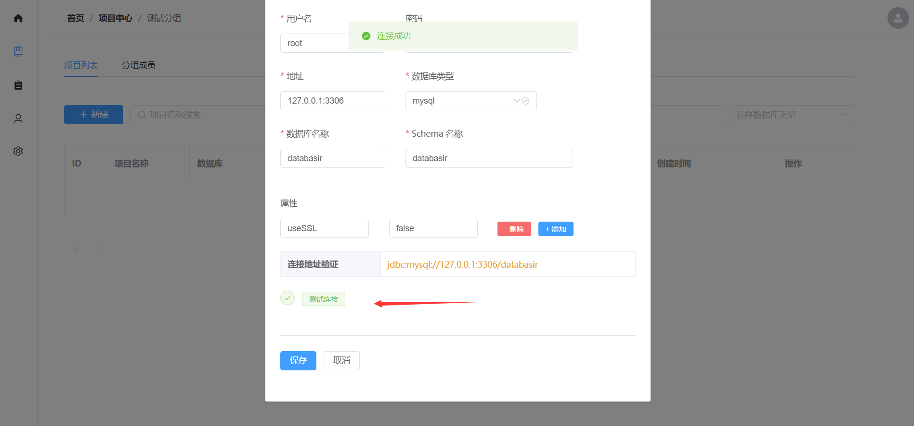

保存完成以后就可以在列表页看见该项目了

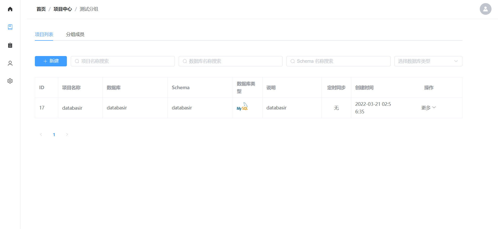

## 删除项目

在所属分组内，组长和组员都用有删除项目的权限。

删除项目很简单，只需要在项目列表页的**更多**菜单中点击**删除项目**即可

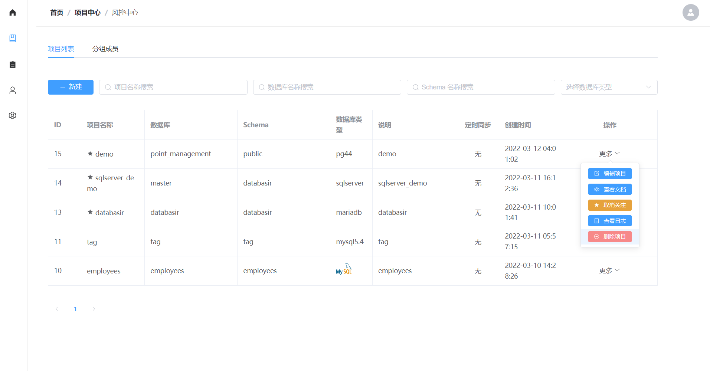

删除需要二次确认，请谨慎操作

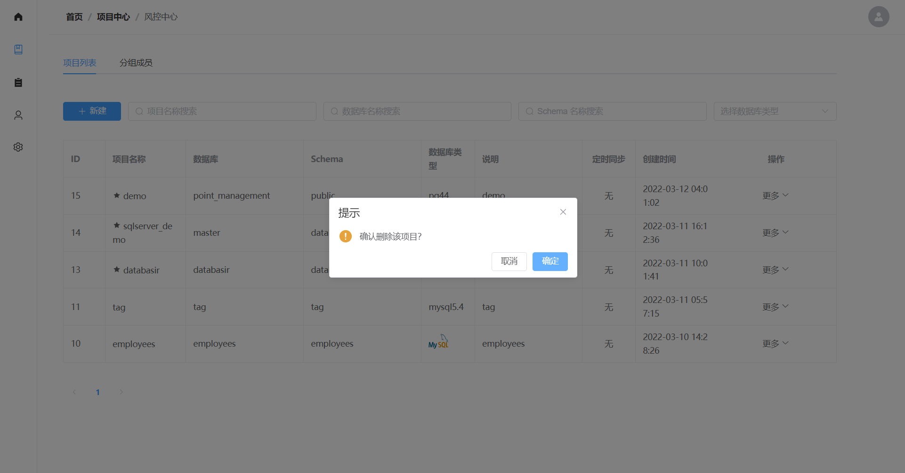

## 关注项目

由于每次查看文档都需要先在分组列表页确定分组，然后在项目列表页确定项目，最后才能查看到文档。

对于每个用户来说，80% 的时间可能都只是在查阅 20% 的项目文档，所以缩减浏览路径将会大大的提升用户体验。

**关注项目**这个功能就是在这样的背景之下产生，它位于首页 Tab，平台会记住用户最近在项目分组和关注项目这两个 Tab 的选择。

比如这次点击了关注项目这个 Tab，下次回到首页以后那么默认选中的就是关注项目 Tab 页

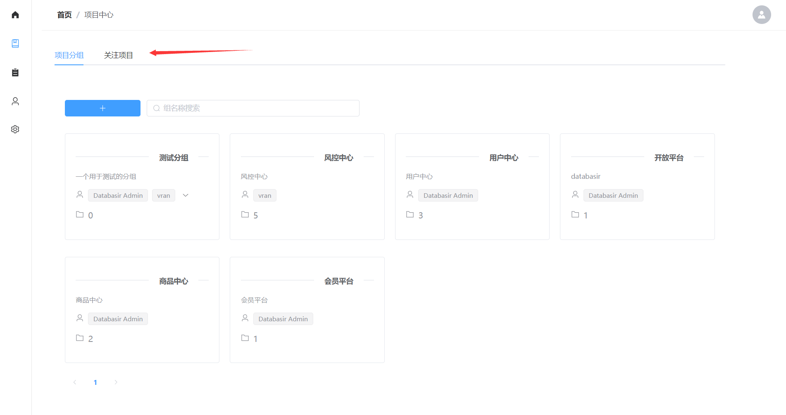

那么如何关注项目呢？

只需要在项目列表页的**更多**菜单中点击对应项目的**关注项目**按钮即可

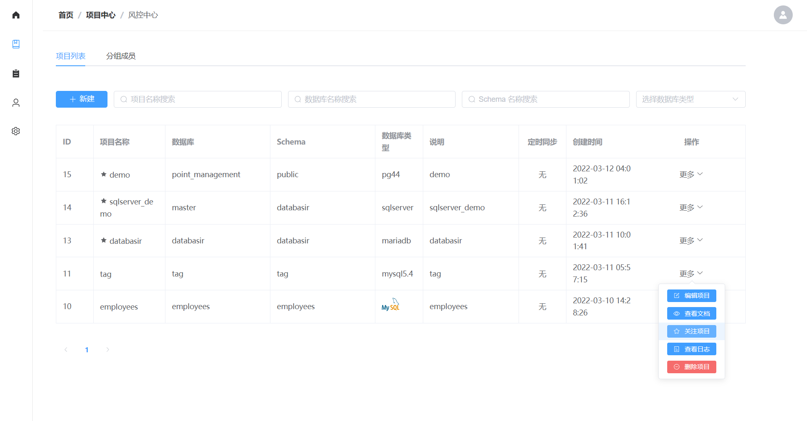

关注完成以后，项目名称前面会多一个 ☆ 标记，回到首页的关注项目 Tab 页，此时也能看到我们的关注项目了。

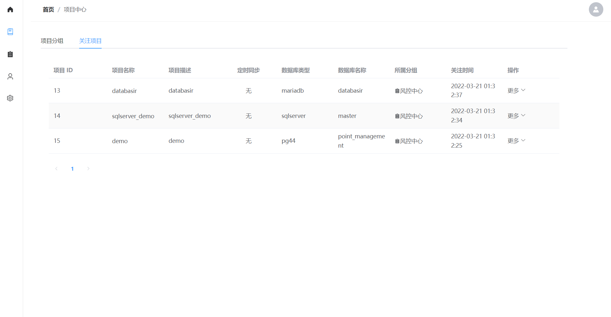

通过点击关注项目列表中的分组名称可以快速回到该项目所属的分组详情页中去。

如果要取消关注，只需要在更多中点击**取消关注**即可

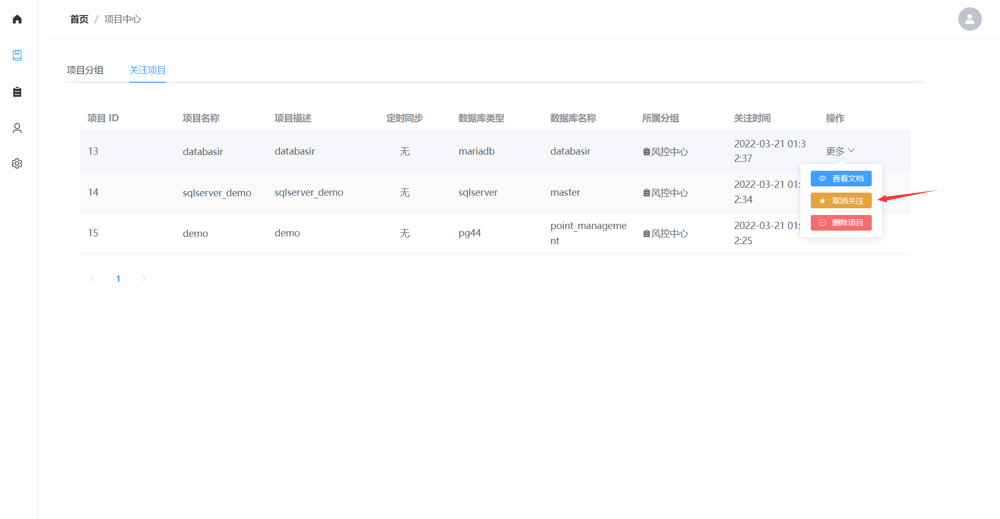

## 手动同步

项目创建完成以后，就可以进入文档页面同步并生成文档了，在更多中点击**查看文档**按钮，或者你也可以直接点击项目名称快捷跳转

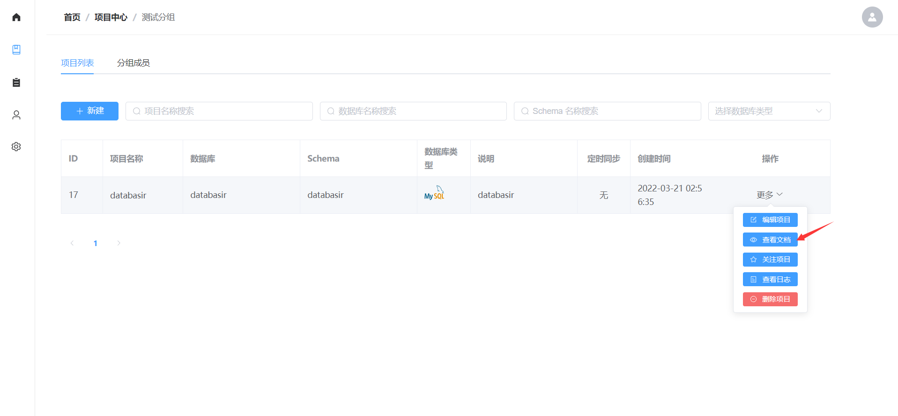

初次进入文档页面时，会显示空内容，这时我们需要手动点击一下

同步完成以后，系统会自动刷新数据，如下图所示

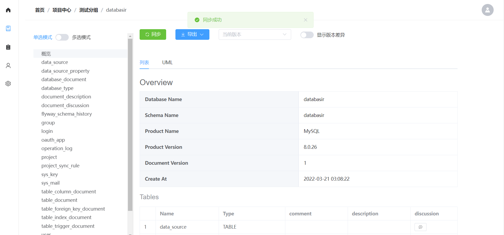

在该页面仍可以点击同步按钮同步文档，**但 Databasir 会自动与当前最新版本的文档做对比，如果没有结构变更，不会创建新的版本内容。**

## 定时同步

每次手动同步文档需要依赖人做操作，这可能造成文档更新的不及时，定时同步则可以解决这个问题。

目前 Databasir 支持按项目配置定时同步规则，时间周期配置使用 cron 表达式。

配置页面位于项目编辑页，该页面有**基础配置**和**高级配置**两个 Tab 页，选择高级配置切换页面后就可以看到定时同步的切换按钮，该功能默认是关闭的

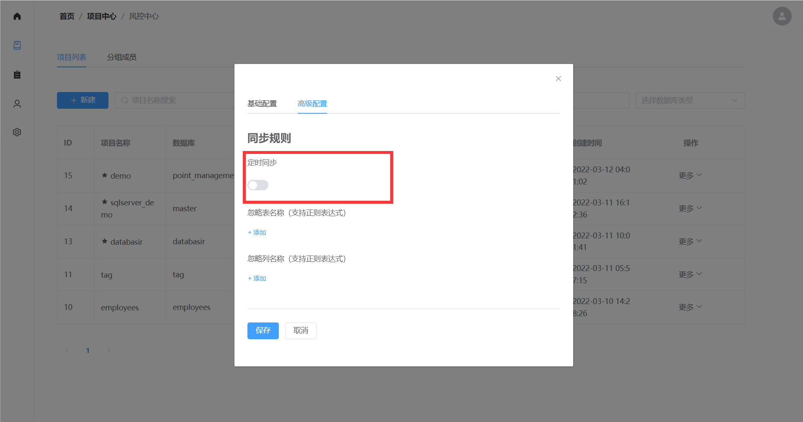

启用以后会要求再输入一个 cron 表达式，比如我这里配置一个每十分钟执行一次的表达式：`0 0/10 * * * ? `，配置完成后点击保存就生效了

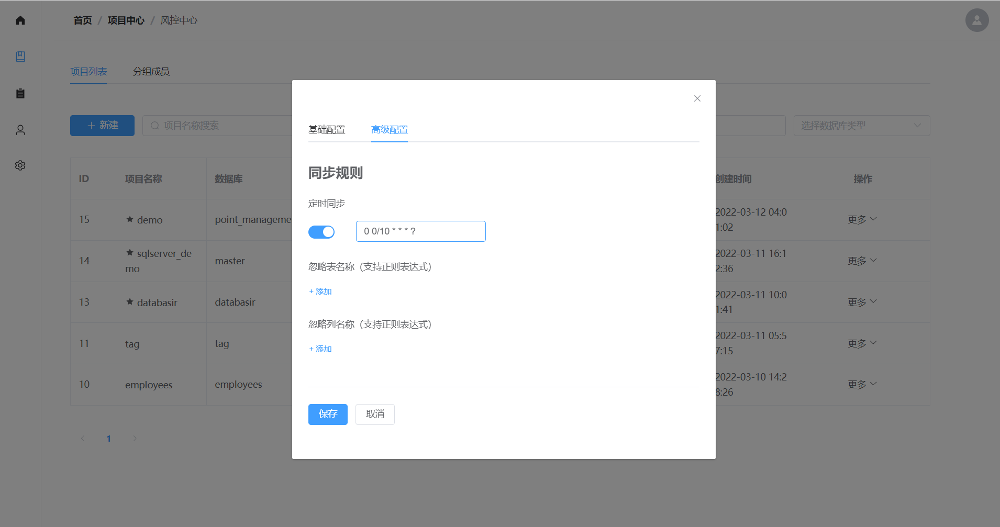

同步记录可以在项目日志里面查看

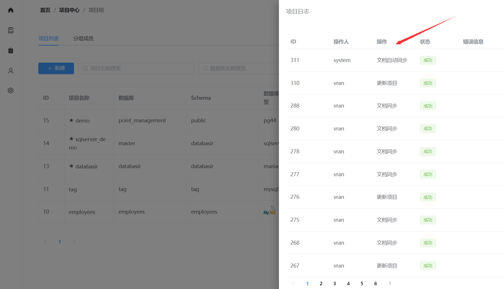

## 忽略表、列同步

模型文档同步中经常需要过滤某些表或字段，在 Databasir 中我们可以通过正则表达式的方式来进行规则配置。

配置页面位于项目编辑页，该页面有**基础配置**和**高级配置**两个 Tab 页，选中高级配置即可看见忽略配置项

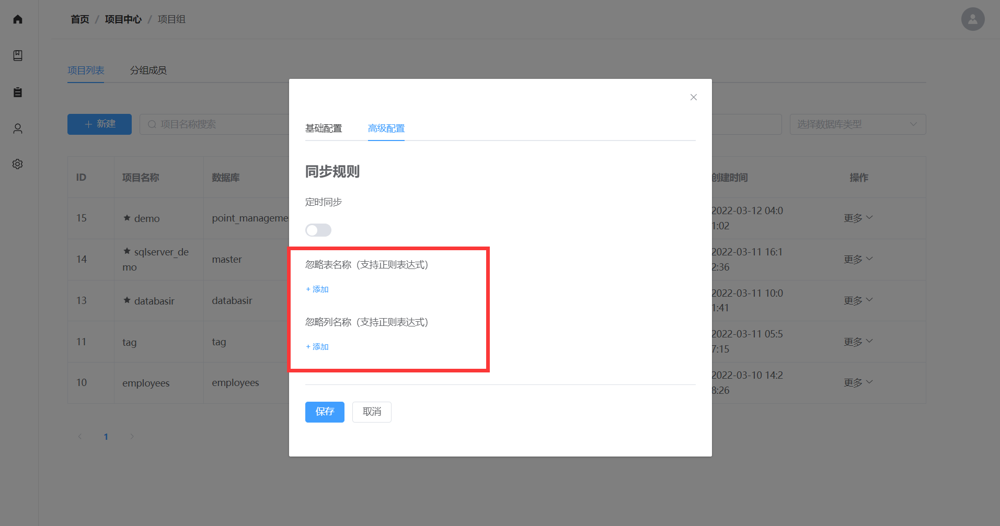

下面我配置了几个忽略规则

表忽略规则

- `flyway.*` ： 忽略以 flyway 开头命名的表
- `demo.*`：忽略以 demo 开头命名的表
- `.*[1-9]$`：忽略以数字 1~9 结尾的表名，这种情况常用于分库分表的场景

列忽略规则

- `create_at.*`：忽略以 create_at 开头命名的列

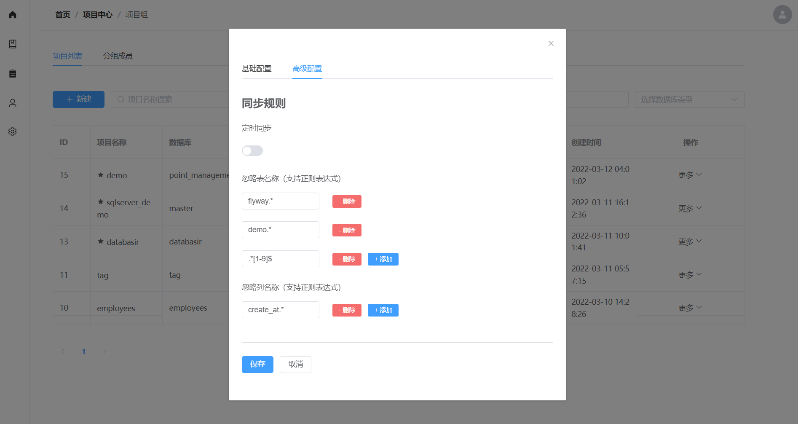

点击保存即可完成配置

## 文档导出

Databasir 支持多种类型的文档格式导出，该功能位于文档详情页面to，通过项目列表中点击指定项目的**查看文档**进入

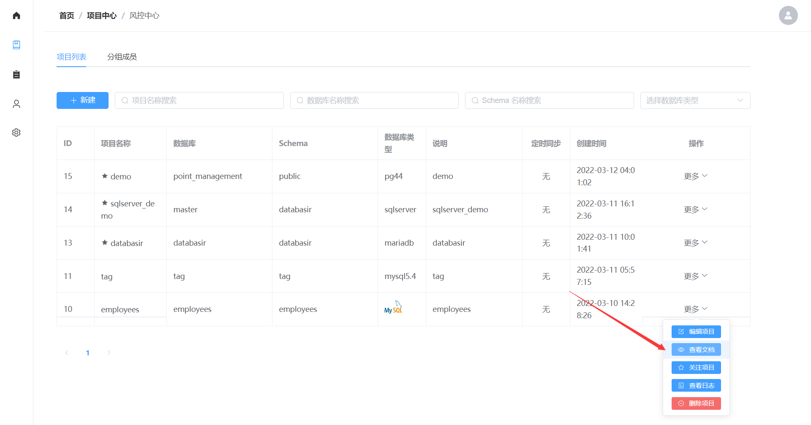

进入文档页面以后，鼠标指向**导出**按钮即可显示出目前支持的文档导出格式

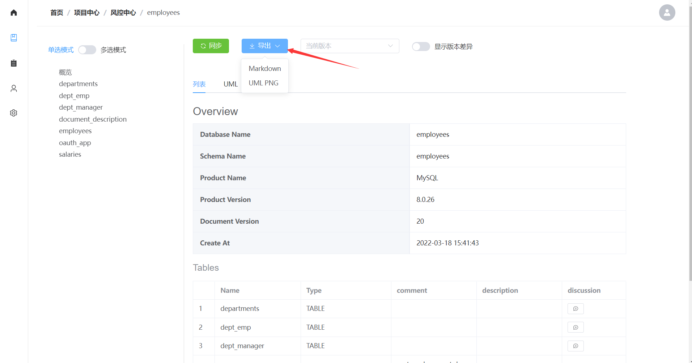

## 版本差异对比 

如果成功同步了多个版本的文档，你可以随意的选择版本进行差异对比。

在文档页面，点击**显示版本差异**按钮

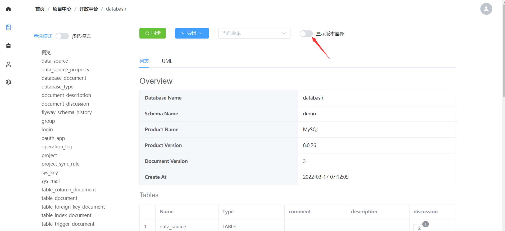

启用以后会出现一个对比版本的下拉框，选择我们要对比的版本，默认情况下基础版本是最新的，也就是在对比新版本比老版本有什么变化

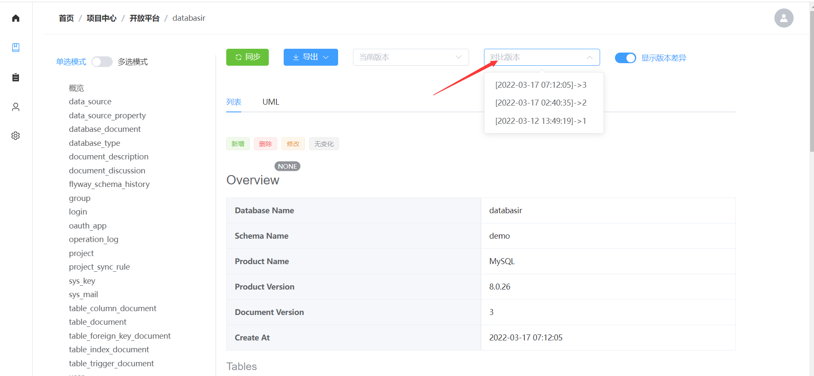

选中版本以后就自动出现了差异标记

- 绿色：标识新增
- 红色：标识删除
- 黄色：标识修改
- 灰色：标识无变化

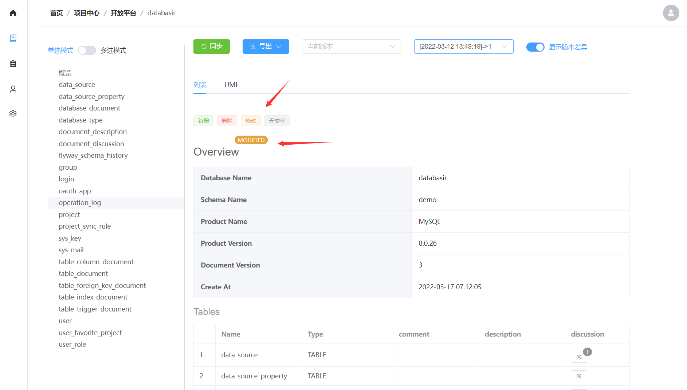

比如下图

- 删除了 document_remark 表
- 修改了 table_column_document、table_document 表
- 新增了 table_foreign_key_document 表

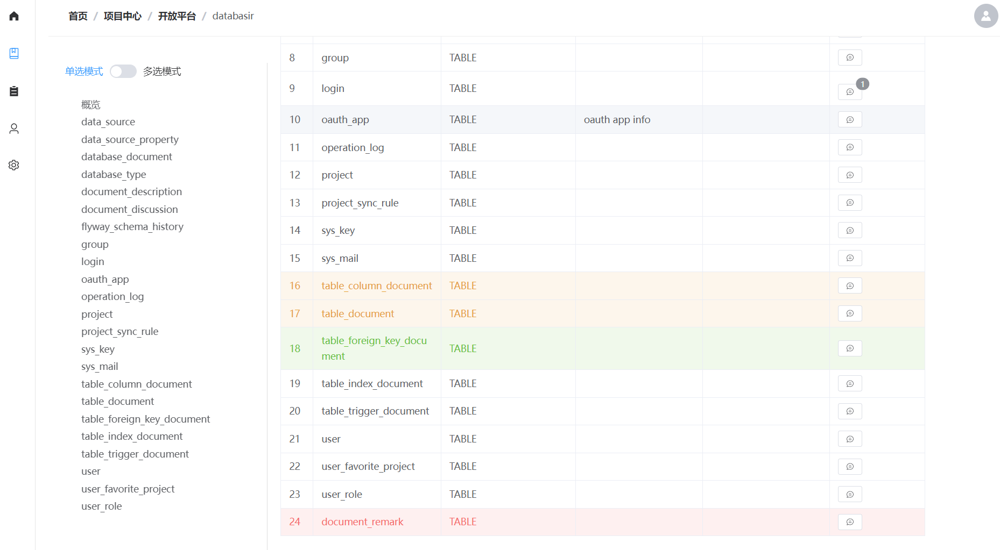

切换到修改表的地方，可以查看具体的修改内容，比如下图就展示了

- type 字段的类型由  text 改为了 varchar
- comment 字段的类型由 text 改为了 varchar

