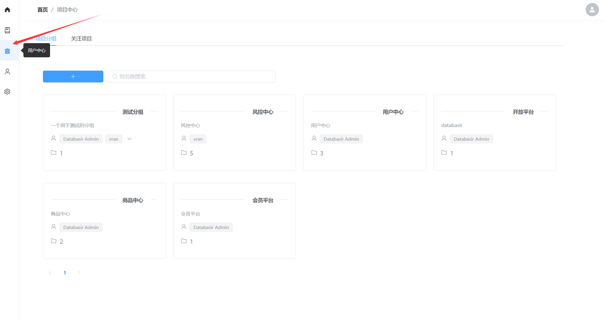
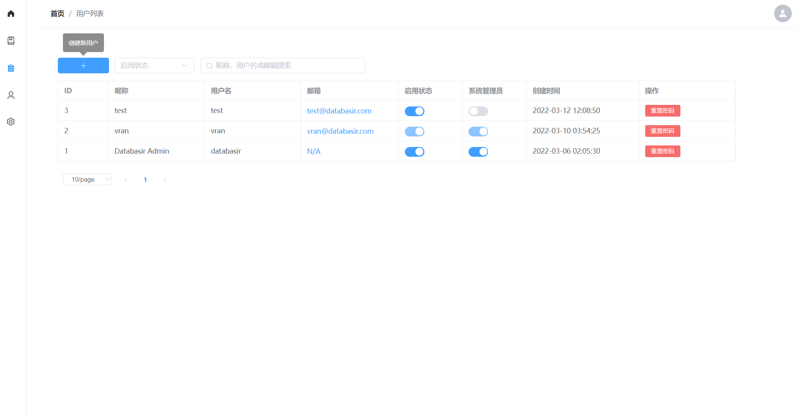
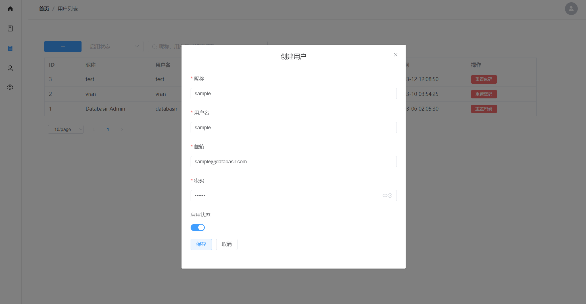
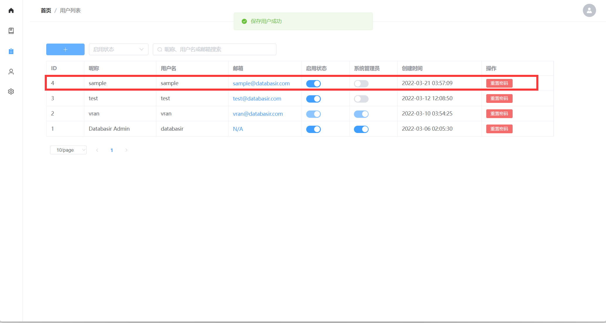
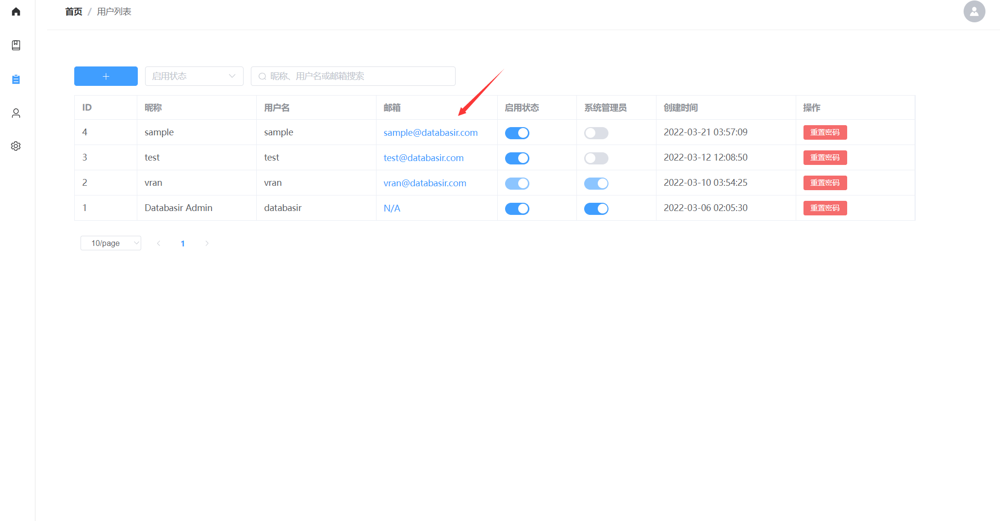
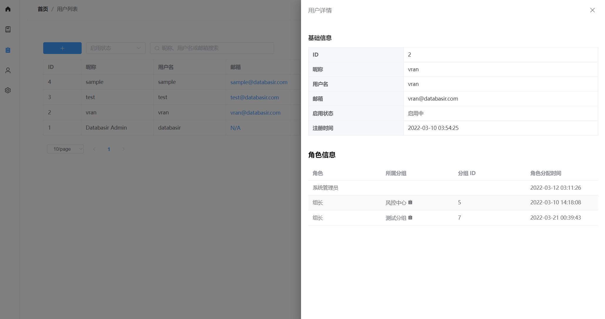
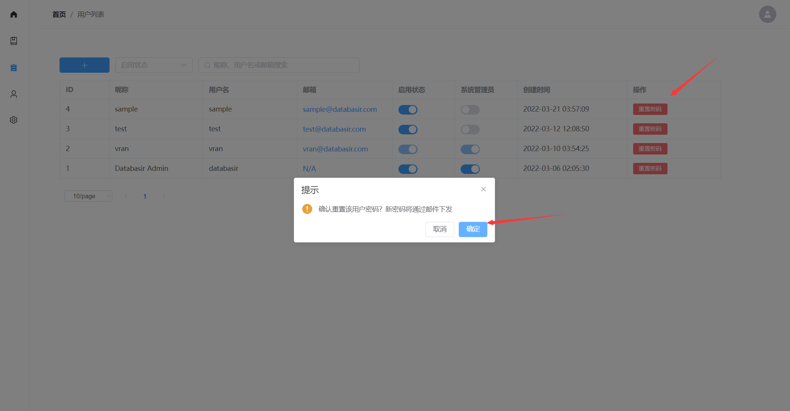
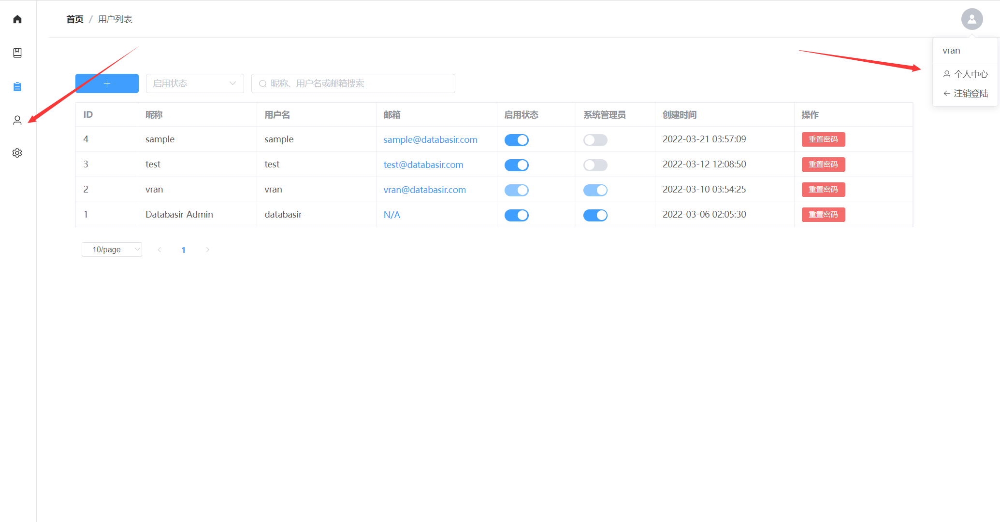
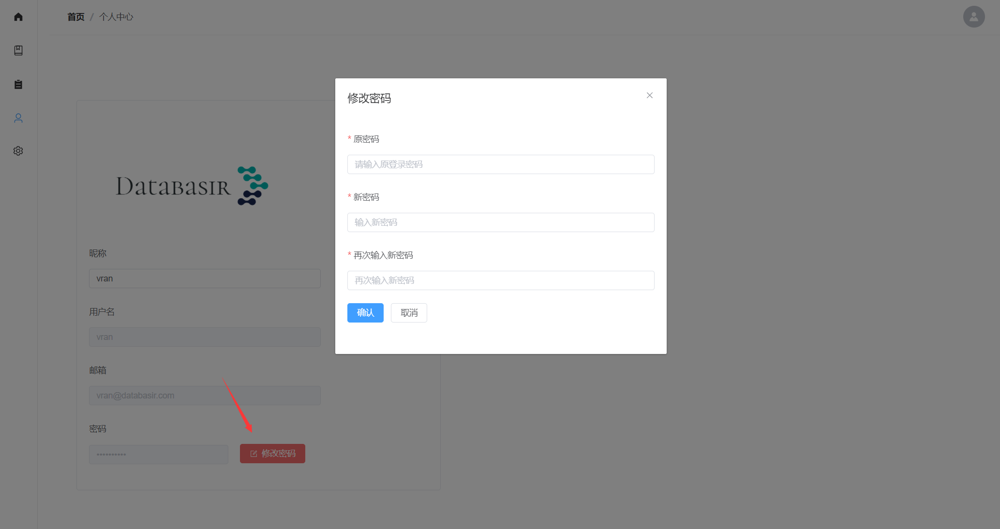

# 用户管理

用户管理模块只有系统管理员有权限执行操作

## 新增用户

在用户中心，点击左上角的 + 号即可创建一个新用户

进入表单页后，需要填写用户的基础信息，并为该用户设置一个密码，默认状态下是未启用状态，需要手动启用。

Databasir 目前不会校验邮箱的真实性，请确保邮箱填写正确

点击保存以后就可以在列表页看见刚刚新增的用户了

## 用户详情

有时候会想查看某个用户加入了哪些分组以及他的一些详细信息，这时候可以通过用户详情查看，该功能位于用户列表页

点击邮箱即可看到详情页，里面会展示用户的详细信息，包括加入的分组，在所属分组承担的角色等。

通过点击分组还可以快捷跳转到分组详情页面

## 修改密码

Databasir 目前支持两种修改密码的方式

- 第一种：系统管理员为指定用户重置密码，新密码通过邮件下发
- 第二种：登录用户通过旧密码确认来修改

第一种方式位于用户中心页面，只有系统管理员才可以进入并有权限执行**重置密码**

第二种方式位于个人主页，可以通过右上角的头像进入，也可以通过侧边栏进入

进入个人主页以后，点击修改密码，就可以通过旧密码验证的方式修改为新密码了

