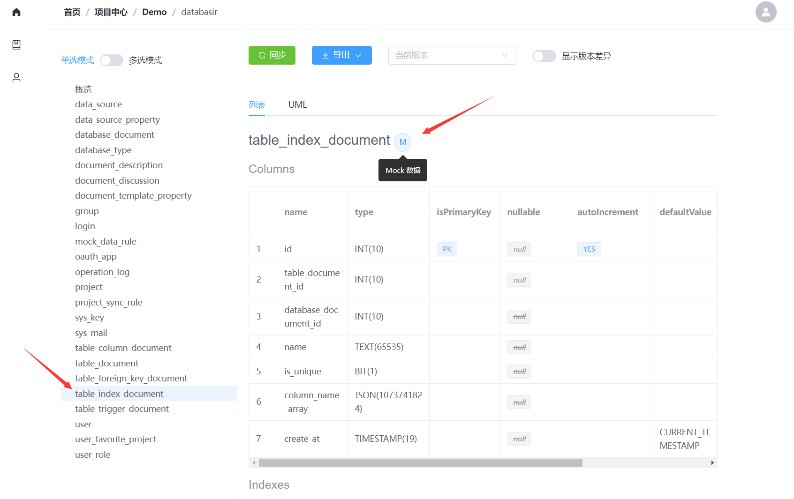
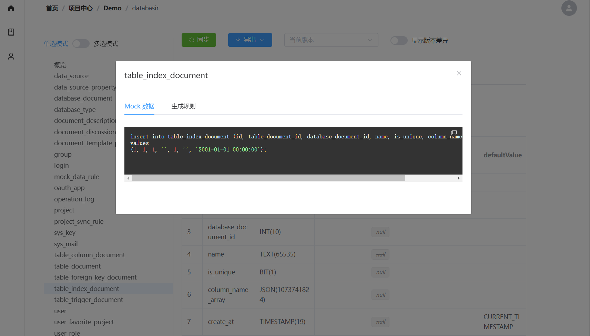

# Mock Insert SQL 生成

## 功能入口

每一张表的文档都包含了完整的列信息，基于这些信息 Databasir 可以生成 Insert SQL，从而降低开发过程中**造数据**的复杂度。

该功能位于文档信息的表名称旁边，一个以  M 标识的按钮

点击按钮就会弹出对话框，该对话框有两部分

- Mock 数据：展示了生成的 sql 语句，可以直接复制
- 生成规则：该 Tab 页面可以配置每个字段的生成规则

## 生成规则

目前 Databasir 提供了 8 种生成规则

| 类型   | 说明                                                         | 类型   |
| ------ | ------------------------------------------------------------ | ------ |
| 自动   | Databasir 会根据列类型生成数据，比如数字就默认是 1，字符串就默认是 '' | -      |
| 关联   | 该字段可以关联其他表的其他列，Databasir 会根据依赖关系生成所有的关联 SQL，并且会自动检测是否出现了循环依赖 | -      |
| 脚本   | Databasir 支持使用 Spel 表达式来定义字段值，比如表达式 "true" 就代表为 true，表达式 "'hello'" 就是 'hello'，目前还处于 Beta 状态 | *      |
| 手机号 | 手机号                                                       | 字符串 |
| 头像   | 头像 URL                                                     | 字符串 |
| UUID   | UUID                                                         | 字符串 |
| 邮箱   | 随机邮箱                                                     | 字符串 |
| 姓名   | 全英文随机姓名                                               | 字符串 |

## SpEl 表达式（Beta）示例

Note：目前脚本模式还处于 Beta 状态，后期有可能会有大的调整。

一、自定义常量值

如果想生成自定义的常量值，可以使用双引号包括起来，比如 

- 布尔值 "true" -> true
- 字符串 "'hello world'" -> 'hello world'
- 数字 "1" -> 1
- 函数 "now()" -> now()