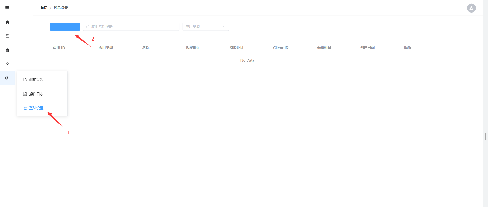

# 启用 Github 第三方认证登录

## 一、创建 Github OAuth 应用
前往 Github 的配置页面创建 Github OAuth Application

点击 `New OAuth App` 就会进入应用创建页面

Homepage URL 填写你部署 databasir 后，可访问的公网域名。

Authorization callback URL 你可以先填写  {{ databasir 域名 }}/login/oauth2/{{ registrationId }}。

这里的 registrationId 你可以任意填写，只需要稍后在 Databasir 中配置时保持一致即可，我这里填写了 `vran_github`。

填好信息以后点击 `Register application` 就能成功创建一个 OAuth Application 了并跳入下图所示页面

在点击 `Generate a new client secret`，生成秘钥以后记得复制暂存一下，以后是看不见原始秘钥的了

记得保存 Client Id 和刚刚生成的 Client Secret。

## 二、Databasir 登录设置

进入 Databasir 系统管理 -> 登录设置

进入到应用创建页面，填写表单信息。

还记得前面提到的 `registrationId`  吗？那个就对应 databasir 中的 `应用 ID` ，只要两者保持一致就可以成功接受 github 的回调。

要是前面配错了也没关系，可以在当前页面复制自动生成的 URL 去 github 重新填写 Authorization callback URL 就可以了。

注意授权地址和资源地址

- 授权地址：获取 access_token 的请求地址
- 资源地址：获取用户信息的请求地址

这里填写不一样是因为 github 官方将授权和资源地址分开的，**如果你使用的时 github enterprise 版本，授权地址和资源地址其实是一样的**。

## 三、登录验证

配置完成以后，注销登录后再次进入登录页面就会发现多了一个 github 的小图标，点击就可以使用 github 进行登录

点击就会进入授权页面，授权完成就会创建一个新的 databasir 用户，并直接登录成功

